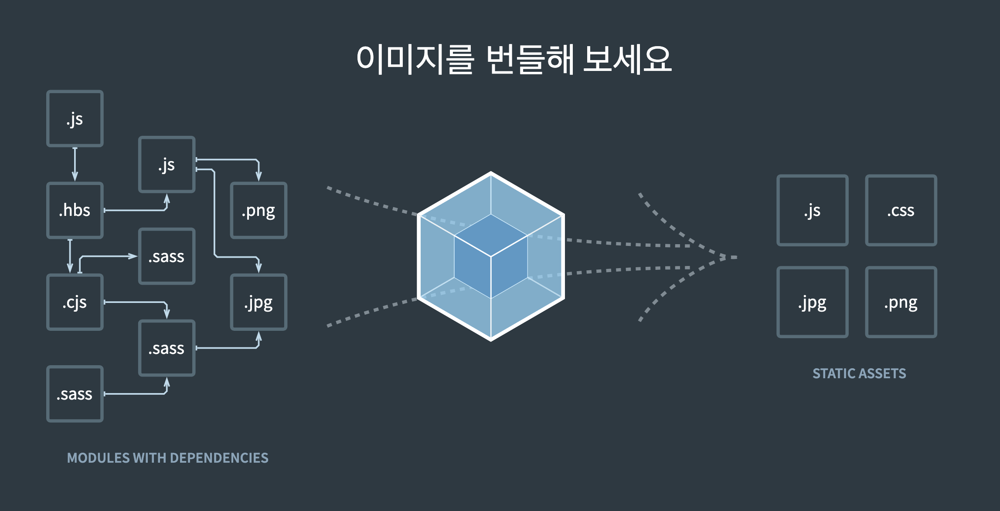

# Babel, Webpack, Polyfill

## babel

babel은 특정 언어를 다른 언어로 변환 시켜주는 트랜스 파일러다.

트랜스파일러가 필요한 이유는 최신 Javascript를 무난한 버전의 언어로 변환 시켜주어야 구형 브라우저를 포함한 모든 브라우저에서 동작하는 개발 환경을 만들 수 있기 때문이다.

즉, babel 패키지를 사용하면 최신 문법의 JavaScript 코드로 자유롭게 개발하더라도, 웹 브라우저와의 호환성은 babel이 책임진다.

실제 babel docs에 나와있는 예시이다.<br/>
ES6에서 도입된 화살표 함수를 babel은 일반 함수로 반환한다.

```js
// Babel Input: ES2015 arrow function
[1, 2, 3].map((n) => n + 1);

// Babel Output: ES5 equivalent
[1, 2, 3].map(function (n) {
  return n + 1;
});
```

바벨이 제공하는 기능은 크게 세가지가 있다.

- **구문 변환**
- 당신의 환경에서 누락된 **polyfill 기능** (core-js와 같은 타사 polyfill 활용)
- **소스 코드 변환**

### Polyfill

오래된 버전의 브라우저에서는 현재 JavaScript에서 사용하고 있는 `Promise`, `Set` 객체를 지원하지 않는 경우가 있다.
<br/>최신 브라우저에서는 잘 동작하지만 오래된 브라우저에서는 실패하는 상황이 발생한다.

이러한 문제를 해결하기 위해서 오래된 브라우저에는 없는 부분을 채워주어야 한다. <br/>

Polyfill은 충전솜이라는 의미를 가지고 있다.babel의 부족한 부분을 채워주는 것이 Polyfill이다. (닉값함) <br/>
구형 브라우저에서 자체적으로 지원하지 않는 최신 기능들을 지원하고자 가져오는 코드 뭉치라고 생각하면 된다.

대부분의 Polyfill은 객체나 메서드가 이미 브라우저에 포함되어 있는 지 확인하고 없으면 값을 채워주는 형태로 동작한다.

```js
Array.prototype.at = Array.prototype.at ?? /* Array.prototype.at에 대한 자체 구현*/;
```

표준적으로 사용되는 Polyfill들은 [core-js](https://github.com/zloirock/core-js) 리포지토리에 모여 있다.

요약하자면 Polyfill이란 신규 JavaScript API를 오래된 버전의 브라우저에서도 사용할 수 있도록 하는 방법이다. <br/>그렇지만, Polyfill 스크립트가 많아지면 웹 성능이 나빠진다.

## Webpack
Webpack은 오픈 소스 JavaScript 모듈 번들러이다.
말 그대로, 여러 개의 파일을 하나의 파일로 묶어주는 역할을 한다.

ES2015의 모듈 시스템과 ES6에서의 `import`, `export` 등장으로 인해 더 이상 HTML 파일에 모든 script 파일을 불러올 필요가 없어졌다.

script 태그에 `type="module"`을 설정할 수 있게 되면서 모듈 형태의 JavaScript를 HTML에 불러올 수 있게 되었다.

이제 index.js라는 하나의 모듈만 불러오면 index.js가 import하고 있는 다른 모듈들은 자동으로 불러온다.
```html
<html>
    <body>
        <script src="./index.js" type="module" />
    </body>
</html>
```

하지만 위와 같은 과정을 모든 브라우저에서 지원하지는 않아서,<br/> 브라우저와 무관하게 모든 파일들을 index.js와 같은 하나의 파일로 만들어주는 모듈이 필요했다.<br/>
그래서 나온 것이 Webpack이다.

Webpack은 하나의 시작점으로부터 의존적인 모듈을 찾아내서 하나의 파일로 만든다.


webpack을 설치하고, 생성된 번들을 `./dist/main.js`라는 파일로 내보내는 옵션들을 설정하면<br/> 빌드 한 뒤 dist 폴더에 main.js라는 이름의 길다란 JavaScript 파일이 생성되는 것을 확인할 수 있다.
```html
<html>
    <body>
        <div id="app">
        <!-- 아래의 main.js가 이 안을 채워 넣음 -->
        </div>
        <script src="/dist/main.js"></script>
    </body>
</html>
```

위의 index.html 파일은 간단한 HTML 구조로 이루어진 웹 페이지이다. 

`<script src="/dist/main.js"></script>` 구문을 통해 main.js 파일이 로드되며, 스크립트 콘텐츠를 id="app" 영역에 렌더링하는 것이다.

결과적으로 이 웹 페이지는 index.html 파일이 뼈대를 제공하고, 웹팩이 번들한 main.js 파일이 핵심적인 동작과 콘텐츠를 구성하여 최종적인 웹페이지로 보여진다.

<br/>

[참고]

- [What is Babel? - 공식 문서](https://babeljs.io/docs/)
- [WebPack과 Babel 그리고 Polyfill에 대해](https://velog.io/@hozzijeong/WebPack%EA%B3%BC-Babel-%EA%B7%B8%EB%A6%AC%EA%B3%A0-Polyfill%EC%97%90-%EB%8C%80%ED%95%B4)
- [똑똑하게 브라우저 Polyfill 관리하기](https://toss.tech/article/smart-polyfills)
- [[개발지식] Webpack과 Babel은 왜 쓰이는 건지 알고 계신가요?](https://junghyeonsu.tistory.com/277)

[이미지 출처]
- [webpack.kr](https://webpack.kr/)
