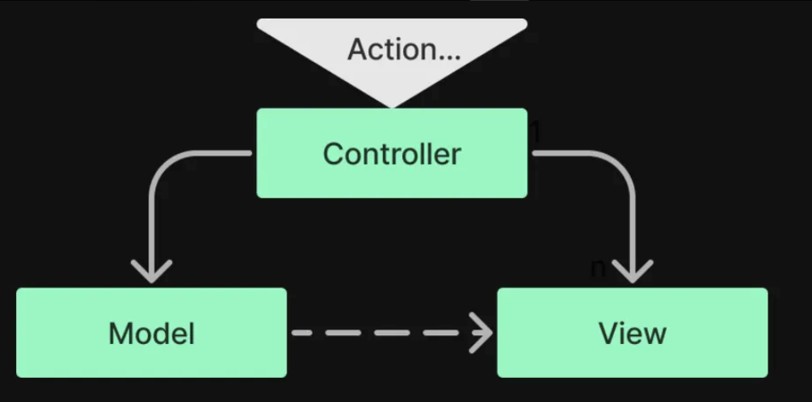
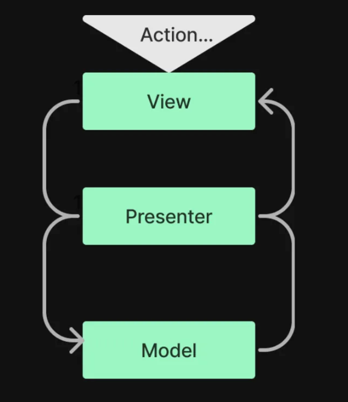
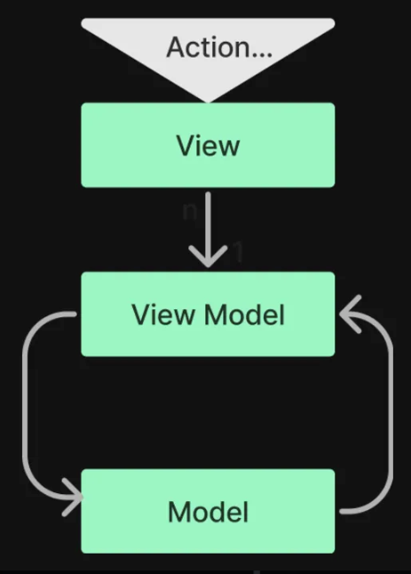

# 프론트엔드 디자인 패턴

### 디자인 패턴(Design Pattern)이란?

디자인 패턴(Design Pattern)은 소프트웨어 설계 과정에서 자주 등장하는 문제 상황에 대한 재사용 가능한 해결책을 정리한 것이다.
이를 통해 코드 재사용성과 유지보수성을 높이고, 팀원 간의 의사소통을 원활하게 할 수 있다. 디자인 패턴은 크게 다음과 같은 세 가지 유형으로 분류된다.

1. 생성적(Creational) 패턴: 객체 생성 과정을 추상화하고 유연하게 관리하는 패턴
   예: Singleton, Factory Method, Abstract Factory, Builder, Prototype 등

2. 구조적(Structural) 패턴: 클래스나 객체를 조합하여 더 큰 구조를 형성하고, 유연성과 확장성을 향상시키는 패턴
   예: Adapter, Bridge, Composite, Decorator, Facade, Proxy 등이 있다.

3. 행위적(Behavioral) 패턴: 객체 간 상호작용과 책임 분배에 초점을 맞추어, 알고리즘과 흐름 제어 방식을 개선하는 패턴
   예: Strategy, Observer, Command, Mediator, Visitor, Chain of Responsibility 등

프론트엔드 아키텍처 패턴(예: MVC, MVP, MVVM)은 구조적 패턴(Structural Pattern)의 영역에 속한다고 볼 수 있다.
이들 패턴은 프론트엔드 애플리케이션을 구성하는 핵심 요소인 데이터(Model), UI(View), 로직(Controller/Presenter/ViewModel) 간의 관계를 정의하고, 이들 사이의 의존성을 최소화하여 애플리케이션을 더 이해하기 쉽고 유지보수하기 편리하게 만들어준다.

아래에서는 프론트엔드 개발에서 주로 언급되는 MVC, MVP, MVVM 패턴에 대해 살펴보자.

### **MVC Architecture**



### Model, View, Controller

- **View**
  - 화면에 보여지는 UI
  - 최종적으로 HTML과 CSS로 만들어지는 결과물
- **Model**
  - 데이터를 주관하는 영역
  - javascript object, server api를 통해 받는 데이터, DB 등 소프트웨어가 다룰 데이터
- **Controller**
  - Model과 View 사이 중간 역할
  - Model의 데이터를 받아서 화면에 그림, 화면으로부터 사용자의 동작을 받아 Model을 변경
  - 사용자와의 상호작용은 Controller에서 담당

### 초창기 웹 서비스의 MVC

특히 프론트엔드라는 구분이 명확하지 않던 시절에는, 웹사이트가 그 자체로 View의 역할을 수행하는 것으로 바라봤다.

- **Model**: Database
- **View**: HTML+CSS+JS
- **Controller**: 라우터를 통해 데이터를 처리하고 새로운 HTML을 만들어서 보여주는 영역

### jQuery 등장 후 MVC

- **Model**: ajax를 통해 받아오는 서버 데이터
- **View**: HTML+CSS
- **Controller**: 서버 데이터를 받아 화면을 바꾸고, 이벤트를 처리해서 서버에 데이터를 전달하는 JavaScript

기존 서버 라우터에서 하던 역할을 클라이언트의 자바스크립트가 처리하게 되고, Database 등은 분리된 백엔드에서 처리하여 REST API를 통해 ajax로 받아오게 되었다.

이 과정에서 jQuery가 Controller의 주요 역할을 하였다.

MVC를 최대한 분리해야 한다는 원칙에 맞게, HTML과 jQuery를 따로 관리하는 것이 주요 포인트였다고 한다.

### MVC의 도입 배경

- Model과 View 간의 의존 관계를 최소화하면, 각자의 수정이 서로에 영향을 미치지 않는다.

### 단점

- View를 업데이트하기 위해서는 결국 Model과 View 사이에 의존성이 존재할 수 밖에 없다. (규모가 커질수록 복잡해지게 됨.)
- 데이터를 받아오고 연동하는 부분에서 반복적인 패턴이 발생할 수 밖에 없게 된다.
- 서버에서 html을 만들어서 내려줄 때에는 어차피 전체적으로 렌더링해야 하므로 `{{ }}`, `<?= ?>`, `<%= %>` 등의 치환자를 통해 선언적인 개발이 가능했으나, jQuery의 경우 전체 html 갱신을 지양해야 하므로 수정해야 할 부분을 일일이 찾아서 수정해야 한다.
- 현대의 Controller는 책임이 많기 때문에 Controller의 크기가 커질 수 밖에 없다.

### **MVP Architecture**



MVC 구조에서 View와 Model간의 의존성을 해결하기 위해 제시된 모델이다.

Controller 대신 Presenter가 생긴 구조로, 한때 Android 개발에서 가장 인기 있었던 구조라고 한다.

- **Model**
  - 데이터를 관리
- **View**
  - 데이터를 보여주는 방식을 정의
  - 사용자의 action이 들어오면 presenter에게 알리는 역할
- **Presenter**
  - Model과 View 사이의 중계자 역할
  - 서로의 요청과 응답을 전달해 줌

### MVP의 장점

- **View-Model 간의 의존성 해소**: Presenter가 중간 역할을 하면서 View와 Model이 직접적으로 의존하지 않도록 만들어준다. 이로 인해 Model의 변경이 직접적으로 View에 영향을 주지 않으며, UI와 데이터 로직이 분리된다.

- **테스트 용이성**: Presenter가 로직을 처리하므로, Unit Test를 통해 Presenter의 기능을 쉽게 테스트할 수 있다.

### MVP의 단점

- **View와 Presenter 간의 1:1 의존성**: View와 Presenter가 1:1로 연결되어, 한 Presenter가 여러 View를 처리하기 어렵다. 이는 구조가 복잡해질 수 있으며, 의존성이 생기기 때문에 테스트 시 Mocking이 필요하다.

### 예시

사용자 프로필 화면을 만드는 상황을 예로 들어 보자. 이 화면에서는 사용자의 이름과 이메일을 표시하고, 사용자가 데이터를 새로 고칠 수 있도록 갱신 버튼을 제공한다.

### 예시 상황

- 사용자가 자신의 프로필 정보를 볼 수 있는 페이지이다.
- `Model`은 사용자 데이터를 서버에서 가져오는 로직을 담당한다.
- `View`는 화면에 UI 요소를 표시하며, 사용자와 상호작용(버튼 클릭)을 Presenter에게 전달하는 역할을 한다.
- `Presenter`는 데이터를 가져오는 로직을 관리하고, Model과 View 사이에서 데이터 전달을 담당한다.

### 예시: 사용자 프로필 페이지

### 1. **Model** - 사용자 데이터 가져오기

```jsx
// Model: 데이터를 가져오는 함수
const fetchUserData = async (userId) => {
  const response = await fetch(`/api/users/${userId}`);
  if (!response.ok) throw new Error("Failed to fetch user data");
  return await response.json();
};
```

### 2. **View** - 사용자 인터페이스 (React 컴포넌트)

```jsx
// View: 사용자 인터페이스를 정의하고 Presenter의 기능을 호출함
import React from "react";

const UserProfileView = ({ user, onRefresh, loading, error }) => (
  <div>
    <h1>User Profile</h1>
    {loading ? (
      <p>Loading...</p>
    ) : error ? (
      <p style={{ color: "red" }}>{error}</p>
    ) : (
      <div>
        <p>Name: {user?.name}</p>
        <p>Email: {user?.email}</p>
      </div>
    )}
    <button onClick={onRefresh}>Refresh</button>
  </div>
);
```

### 3. **Presenter** - 상태 관리와 로직 처리

Presenter 역할을 하는 `UserProfilePresenter`는 상태 관리와 데이터 로딩 로직을 처리한다.

```jsx
// Presenter: 사용자 데이터를 가져오고 View를 업데이트하는 로직
import React, { useEffect, useState, useCallback } from "react";

const UserProfilePresenter = () => {
  const [user, setUser] = useState(null); // 사용자 데이터 상태
  const [loading, setLoading] = useState(false); // 로딩 상태
  const [error, setError] = useState(null); // 오류 상태

  const userId = "123"; // 사용자 ID

  const loadUserData = useCallback(async () => {
    setLoading(true);
    setError(null);
    try {
      const userData = await fetchUserData(userId);
      setUser(userData);
    } catch (err) {
      setError(err.message);
    } finally {
      setLoading(false);
    }
  }, [userId]);

  // 컴포넌트가 마운트될 때 데이터 로딩
  useEffect(() => {
    loadUserData();
  }, [loadUserData]);

  return (
    <UserProfileView
      user={user}
      onRefresh={loadUserData}
      loading={loading}
      error={error}
    />
  );
};

export default UserProfilePresenter;
```

### 동작 방식 설명

1. **Model**: `fetchUserData` 함수는 서버에서 사용자 데이터를 가져오는 비동기 함수이다.
2. **View**: `UserProfileView`는 사용자 인터페이스를 정의한다. `user`, `loading`, `error` 상태를 통해 UI를 렌더링하며, 새로고침 버튼 클릭 시 `onRefresh`를 호출하여 Presenter가 데이터를 다시 로드하도록 요청한다.
3. **Presenter**: `UserProfilePresenter`는 `user`, `loading`, `error` 상태를 관리하며, 데이터를 가져오고 UI를 업데이트하는 로직을 처리한다. `loadUserData` 함수는 데이터를 불러오고 상태를 업데이트하며, `useEffect`로 컴포넌트 마운트 시 데이터를 불러온다.

이 구조를 통해 View는 Model을 직접 참조하지 않고, Presenter가 데이터를 관리하여 UI에 업데이트한다. 이는 View와 Model 간의 의존성을 줄이고, Presenter를 중심으로 데이터 로직과 UI 업데이트 로직을 분리하여 코드가 더 깔끔해진다.

### **MVVM Architecture**



2013년 구글의 앵귤러 발표로 웹 개발 방식의 패러다임이 전환되기 시작한다.

jQuery를 통해 DOM을 직접 조작하는 방식에서, 템플릿과 바인딩을 통한 선언적인 방법으로 변화하게 된다.

MVC의 역할은 그대로이나, 이를 구현하는 방식이 바뀐 것에 가깝다.

FE 코드에서 DOM을 직접 조작하던 코드는 사라지고, 이 기능은 프레임워크가 담당하게 되며, 개발자는 화면에 그려져야 할 데이터만 만들면 프레임워크가 알아서 그려 주었다. ⇒ 이를 View를 그리는 Model만 신경쓰게 되었다는 의미로 ViewModel이라고 부른다.

- **Model**: 데이터
- **View**: 시각적인 요소
- **ViewModel**: Model을 가지고 View를 그리는 역할이자, View가 Model과 상호작용할 수 있게 하는 역할. UI의 재사용 가능한 부분을 추상적으로 표현할 수 있음.

이후 등장하는 React, Vue, Angular2, Svelte 등은 모두 어떤 방식의 템플릿과 [바인딩 문법](https://en.wikipedia.org/wiki/Data_binding)을 쓰느냐에 차이가 있을 뿐, MVVM이라는 아키텍처는 대부분 그대로 유지된다.

### 장점

- 컨트롤러의 반복적인 기능을 선언적인 방식으로 개선하였다.
- Model과 View의 관점을 분리하지 않고, 하나의 템플릿을 통해 관리하려는 방식으로 발전하게 된다.
  - 기존: class, id를 통해 간접적으로 HTML에 접근
  - 개선: 직접 HTML에 접근할 수 있게 됨
- 웹의 DOM api를 잘 몰라도 비지니스 로직만으로 서비스를 만들 수 있다.

### MVVM의 구성 요소

1. **Model**
   - 데이터와 비즈니스 로직을 담당하는 부분으로, 서버에서 데이터를 가져오거나, 로컬에서 데이터를 관리한다.
   - 일반적으로 API 호출이나 데이터베이스 접근 등을 포함한다.
2. **View**
   - 사용자 인터페이스(UI)를 나타내는 부분으로, 사용자가 보는 화면을 담당
   - 데이터의 변화를 감지하고 ViewModel의 데이터를 바인딩하여 화면에 반영
   - React에서는 컴포넌트가 View의 역할을 하며, View는 ViewModel과 상호작용
3. **ViewModel**
   - Model에서 데이터를 가져와 가공하거나 필요한 UI 상태를 관리하고, 이를 View에 전달하는 역할
   - View와 Model의 중간에 위치하여 데이터를 받아 가공하고, View에서 필요한 형식으로 전달
   - React에서는 주로 상태와 비즈니스 로직을 담당하는 `useState`, `useEffect`, `useMemo`와 같은 Hook을 활용하여 ViewModel을 구현

### 예시

### 예시: 사용자 프로필 페이지 구현 (React)

### 1. Model - 데이터 처리 로직

Model은 데이터를 서버에서 가져오고 필요한 경우 데이터를 가공하는 역할을 한다.

```jsx
// Model: 데이터를 가져오는 함수
const fetchUserData = async (userId) => {
  const response = await fetch(`/api/users/${userId}`);
  if (!response.ok) throw new Error("Failed to fetch user data");
  return await response.json();
};
```

### 2. ViewModel - 상태 관리 및 로직

ViewModel은 데이터를 불러오고 상태를 관리한다. `useState`, `useEffect`를 사용해 데이터를 가져오고 상태를 관리하는 부분을 ViewModel로 볼 수 있다.

```jsx
// ViewModel: 상태와 비즈니스 로직 관리
import { useState, useEffect } from "react";

const useUserProfileViewModel = (userId) => {
  const [user, setUser] = useState(null);
  const [loading, setLoading] = useState(true);
  const [error, setError] = useState(null);

  useEffect(() => {
    const loadUserData = async () => {
      setLoading(true);
      try {
        const data = await fetchUserData(userId);
        setUser(data);
      } catch (err) {
        setError(err.message);
      } finally {
        setLoading(false);
      }
    };
    loadUserData();
  }, [userId]);

  return { user, loading, error };
};
```

### 3. View - 사용자 인터페이스

View는 ViewModel의 상태를 구독하고, 이를 UI에 바인딩하여 사용자에게 보여준다. 이 부분에서는 `useUserProfileViewModel`로부터 데이터를 받아 화면에 렌더링한다.

```jsx
// View: 사용자 인터페이스
import React from "react";

const UserProfile = ({ userId }) => {
  const { user, loading, error } = useUserProfileViewModel(userId);

  if (loading) return <p>Loading...</p>;
  if (error) return <p style={{ color: "red" }}>{error}</p>;

  return (
    <div>
      <h1>User Profile</h1>
      <p>Name: {user.name}</p>
      <p>Email: {user.email}</p>
    </div>
  );
};

export default UserProfile;
```

### 동작 방식 설명

1. **Model**: `fetchUserData` 함수는 API에서 데이터를 가져오는 역할을 한다.
2. **ViewModel**: `useUserProfileViewModel`은 데이터를 가져오는 로직과 상태를 관리하며, UI에서 사용할 데이터를 가공하여 반환한다. 이를 통해 View에서 직접 데이터를 불러오는 로직을 분리할 수 있다.
3. **View**: `UserProfile` 컴포넌트는 ViewModel의 데이터를 가져와 화면에 표시하며, `loading`이나 `error` 상태에 따라 UI를 다르게 렌더링힌다.

### MVVM 패턴의 장점

- **명확한 책임 분리**: View, Model, ViewModel이 각각의 역할을 담당하여 코드를 구조적으로 관리할 수 있다.
- **상태 관리와 UI 로직 분리**: ViewModel이 데이터를 가공하여 전달하기 때문에, View는 UI 렌더링에만 집중할 수 있다.
- **재사용성**: ViewModel은 여러 View에서 재사용 가능하며, 데이터를 처리하고 관리하는 로직을 별도로 모듈화할 수 있다.

[참고]

- [Frontend Design Pattern](https://velog.io/@aborile/Frontend-Design-Pattern)

[이미지 출처]

- [Frontend Design Pattern](https://velog.io/@aborile/Frontend-Design-Pattern)
