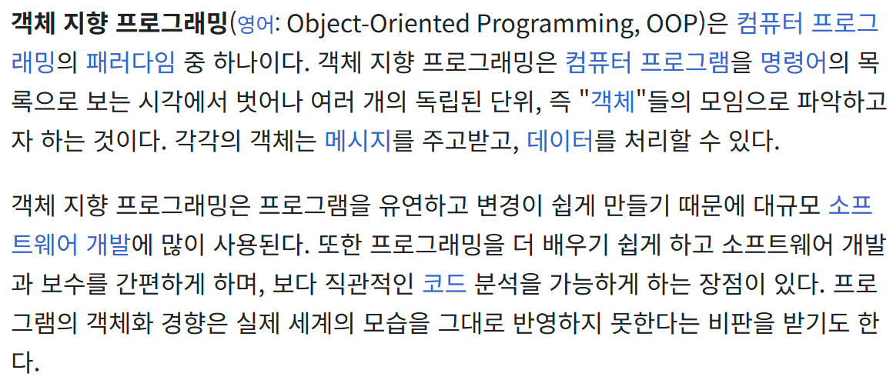
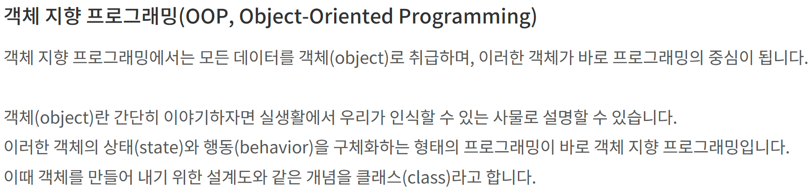
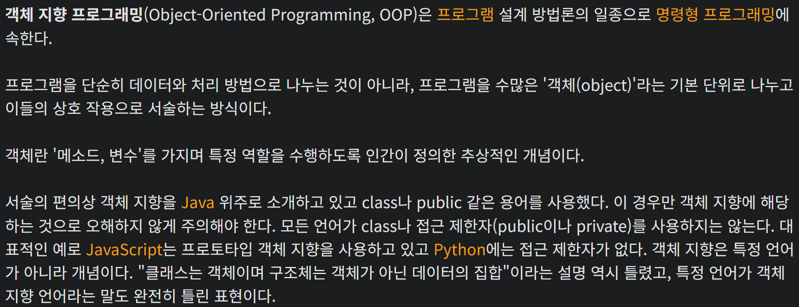
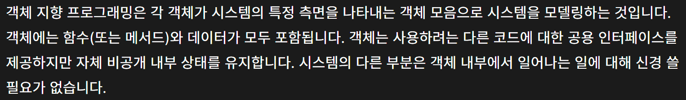

# 캡슐화와 다형성

> 유지보수 비용을 낮추려면 다양한 방법을 적용해야 한다.
> <br/>먼저 프로그래밍 패러다임을 알맞게 적용하는 방법이 있다.
> <br/>객체 지향 프로그래밍과 함수형 프로그래밍은 대표적인 프로그래밍 패러다임이다.
> <br/>객체 지향 프로그래밍의 캡슐화와 다형성을 활용하면 변경으로 인한 영향 범위가 줄기 때문에 수정을 최소화할 수 있다.
>
> **최범균, 육각형 개발자, 한빛미디어, 2023, p.65.**

많이는 들어봤으나 들을 때마다 모르겠다.
<br/>책에 나온 두 가지 개념을 간단히 정리해보고자 한다.

## 객체 지향 프로그래밍(OOP)

<br/>
<br/>
<br/>


객체 지향에 대한 설명글이다.
<br/>안타깝게도 아직도 잘 모르겠다.

## 캡슐화(encapsulation)

> 객체의 데이터를 외부에서 직접 접근하지 못하도록 숨기고,
> <br/>필요한 경우 메서드를 통해 접근하도록 제한한다.

아래와 같은 코드에 캡슐화를 적용하면,

```javascript
const createAccount = (balance) => ({
  balance,
  getBalance: function () {
    return this.balance;
  },
  deposit: function (amount) {
    this.balance += amount;
  },
  withdraw: function (amount) {
    if (this.balance >= amount) {
      this.balance -= amount;
    } else {
      console.log("잔액 부족");
    }
  },
});

const account = createAccount(1000);
console.log(account.getBalance()); // 1000

account.deposit(500);
console.log(account.getBalance()); // 1500

account.withdraw(200);
console.log(account.getBalance()); // 1300

// balance 직접 조작 가능 (안전X)
account.balance = -500;
console.log(account.getBalance()); // -500 (잘못된 값)
```

요래 된다.

```javascript
const createAccount = (balance) => ({
  getBalance: () => balance,
  deposit: (amount) => createAccount(balance + amount),
  withdraw: (amount) =>
    balance >= amount
      ? createAccount(balance - amount)
      : { error: "잔액 부족" },
});

// 계좌 생성
let account = createAccount(1000);
console.log(account.getBalance()); // 1000

// 입금 (새로운 계좌 반환)
account = account.deposit(500);
console.log(account.getBalance()); // 1500

// 출금 (새로운 계좌 반환)
account = account.withdraw(300);
console.log(account.getBalance()); // 1200

// 잔액 부족 상황 테스트
let result = account.withdraw(1500);
console.log(result.error || result.getBalance()); // "잔액 부족"

// balance 직접 변경 불가능
account.balance = -500;
console.log(account.getBalance()); // 1200 (변경되지 않음)
```

이를 통해 데이터 무결성을 유지하며, 의도치 않은 데이터 변경을 방지할 수 있다.

## 다형성 (polymorphism)

> 동일한 인터페이스를 통해 서로 다른 동작을 구현할 수 있는 능력.
> <br/>주로 상속이나 인터페이스를 통해 구현된다.

마찬가지로, 아래 코드에 다형성 개념을 적용하여

```javascript
function printAnimalSound(animal) {
  if (animal === "dog") {
    console.log("월월");
  } else if (animal === "pig") {
    console.log("꿀꿀");
  } else {
    console.log("알 수 없는 동물이에요");
  }
}

printAnimalSound("dog"); // "월월"
printAnimalSound("pig"); // "꿀꿀"
printAnimalSound("cat"); // "알 수 없는 동물이에요"
```

이렇게 정리할 수 있다.

```javascript
const animalSounds = {
  dog: () => "월월",
  pig: () => "꿀꿀",
  default: () => "알 수 없는 동물이에요",
};

const getAnimalSound = (animal) => (animalSounds[animal] || animalSounds.default)();

console.log(getAnimalSound("dog")); // "월월"
console.log(getAnimalSound("pig")); // "꿀꿀"
console.log(getAnimalSound("cat")); // "알 수 없는 동물이에요"
```

조건문 없이도 동작을 추가하거나 변경할 수 있어 코드가 간결해지고 확장성이 높아진다.

## 정리

- 캡슐화: 데이터를 안전하게 보호하고, 객체의 내부 구현을 숨겨 외부에서는 객체의 메서드만 사용할 수 있도록 한다.
- 다형성: 객체의 인터페이스를 통일하여, 조건문 없이도 다양한 동작을 유연하게 처리할 수 있다.

## 결론

이 두 가지 개념을 적절히 활용하면 코드의 가독성, 재사용성, 확장성이 향상되어 유지보수 비용을 줄일 수 있다.

[참고]

- [객체 지향 프로그래밍 - 위키백과, 우리 모두의 백과사전](https://ko.wikipedia.org/wiki/%EA%B0%9D%EC%B2%B4_%EC%A7%80%ED%96%A5_%ED%94%84%EB%A1%9C%EA%B7%B8%EB%9E%98%EB%B0%8D)
- [객체 지향 프로그래밍 - 나무위키](https://namu.wiki/w/%EA%B0%9D%EC%B2%B4%20%EC%A7%80%ED%96%A5%20%ED%94%84%EB%A1%9C%EA%B7%B8%EB%9E%98%EB%B0%8D)
- [객체 지향 프로그래밍 - Web 개발 학습하기](https://developer.mozilla.org/ko/docs/Learn_web_development/Extensions/Advanced_JavaScript_objects/Object-oriented_programming)
- [클래스의 개념 - TCP School](https://www.tcpschool.com/java/java_class_intro)
