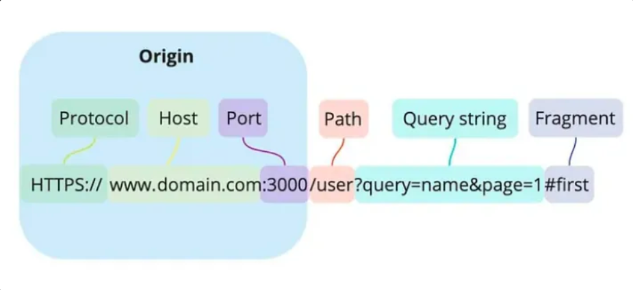
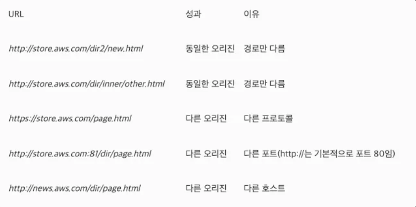
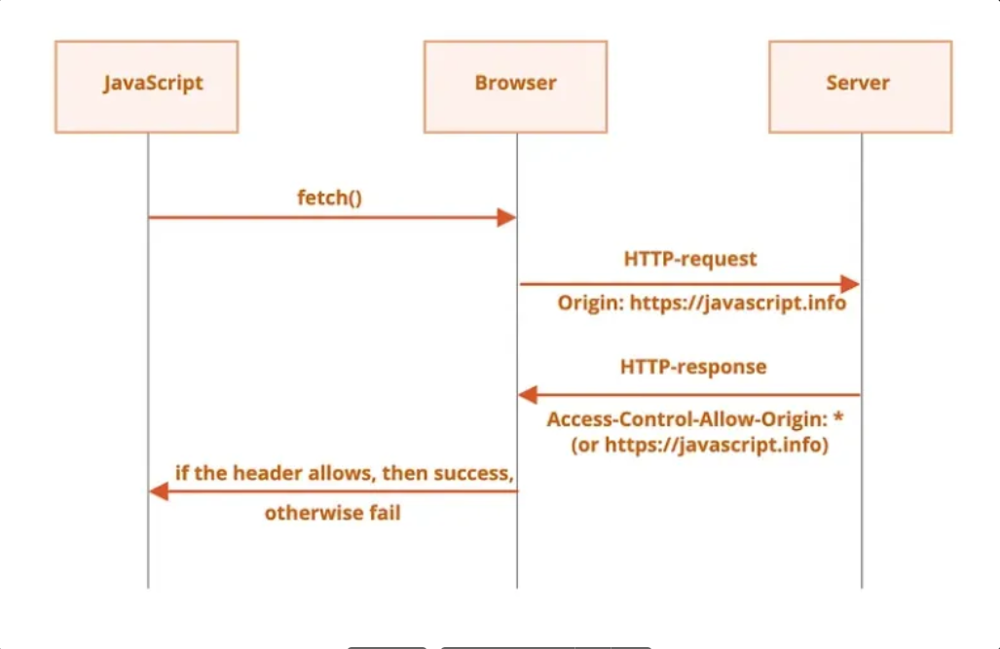

# FrontEnd

- [브라우저 동작 과정](#브라우저-동작-과정)
- [REST API](#rest-api)
- [앱 개발 방식](#앱-개발-방식)

---

## 브라우저 동작 과정

### 브라우저란?

브라우저(Browser)는 사용자가 인터넷에 접속하여 웹 페이지를 탐색하고 HTML 문서, 이미지 등 여러 컨텐츠를 우리에게 표현해주는 소프트웨어 또는 애플리케이션을 의미한다.

Google Chrome, Apple의 Safari, Microsoft Edge, Mozilla의 FireFox 등이 있다.

주요 기능은 <u>사용자가 선택한 자원을 서버에 **요청**하고, 서버로부터 받은 **응답**을 브라우저에 **렌더링**하는 것</u>이다.

### 웹 브라우저와 웹 서버의 통신 과정

사용자가 브라우저에 웹 페이지 주소를 입력하면 웹 브라우저와 웹 서버는 아래와 같이 통신한다.

1. 사용자가 도메인 주소를 넣으면 DNS를 통해 도메인 주소에 해당하는 IP 주소를 얻는다.
2. IP 주소 기반으로 HTTP Request가 만들어지고, 해당 IP를 가진 서버에 전송된다.
3. 서버에서는 TCP/IP 네트워크 스택을 통해 응답을 만들어 전송한다.
4. 웹 브라우저는 패킷의 body에 들어있는 HTML 파일을 렌더링 해서 웹 브라우저에 보여준다.

### 브라우저 구조

브라우저는 아래와 같은 구조를 가진다.

- `User Interface`: 요청한 페이지를 보여주는 창 이외의 모든 UI
  - ex) 주소창, 새로고침, 북마크 등
- `Browser Engine`: UI와 렌더링 엔진의 중개자.
  - ex) 새로고침 버튼이 클릭 되었을 때 브라우저 엔진이 이를 수행
- `Rendering Engine`: HTML, CSS, JS를 파싱한 결과를 바탕으로 페이지를 그림
- `Network`: HTTP, HTTPS 같은 프로토콜을 이용해 외부 리소스를 얻음
- `JavaScript 인터프리터`: JavaScript를 해석하고 실행
- `UI 백엔드`: 렌더링 엔진이 분석한 렌더 트리를 브라우저에 그리는 역할. 브라우저가 동작하고 있는 운영체제의 인터페이스들을 따르는 기본적인 위젯 처리
  - ex) 안드로이드와 iOS의 서로 다른 Alert, Select Box 등
- `웹 스토리지`: 브라우저 자체에서 하드디스크와 같이 데이터를 로컬에 저장하기 위한 레이어

### 렌더링 동작 과정 (Critical Rendering Path)

웹 브라우저와 웹 서버의 통신이 끝나고, 브라우저에 출력되는 단계([웹 브라우저와 웹 서버의 통신의 4번째 단계](#웹-브라우저와-웹-서버의-통신-과정))를 Critical Rendering Path라고 한다. 이 단계는 크게 5단계로 구분된다.
웹 페이지에 사용자가 접속하게 되면, 네트워크를 통해 해당 페이지의 HTML 문서를 얻어올 수 있다. 그러면 렌더링 엔진이 읽어 들인 HTML 문서를 해석한다.

**1. 2. DOM Tree와 CSSOM Tree Build**
 
브라우저는 HTML, CSS, JavaScript 세 종류의 언어를 해석할 수 있다. 그 중 JavaScript는 렌더링 엔진이 아니라 별도의 JavaScript 해석기라는 별도의 레이어에서 언어를 해석한다. 따라서 렌더링 엔진에서는 HTML과 CSS를 해석한다.

1. _DOM Tree Build_
    HTTP 또는 HTTPS 통신으로 byte 형태의 HTML 파일을 가져오게 된다. 이 후 이 byte 형태의 데이터를 DOM으로 전환하는 작업을 수행한다.

2. _CSSOM Tree Build_
    렌더링 엔진은 HTML 문서를 위에서부터 한 줄씩 파싱하며 DOM을 생성한다. 그러다 CSS를 로드하는 link 태그 혹은 style 태그를 만나면 DOM 생성을 중지한 후 CSS parsing의 결과물인 CSSOM을 생성하는 과정을 진행한다.

**3. 렌더 트리 구축**
 DOM 트리가 구성되는 동안 브라우저는 렌더 트리를 구성한다. 렌더 트리는 DOM 트리와 CSSOM 트리를 조합하여 만들어진다. 이는 어떠한 요소들이 보여야 하는지, 어떤 스타일이 적용되어야 하는지, 그리고 어떤 순서로 나타낼 것인지를 명세한다.

**4. 레이아웃 또는 리플로우**
 
이 단계에서 Rendering Tree의 각 Node들의 위치와 크기가 계산된다. 페이지에서 각 객체의 정확한 위치와 크기를 계산하기 위해 브라우저는 렌더링 트리를 루트에서부터 순회한다. viewport 내에서 각 요소의 정확한 위치와 크기를 캡쳐하는 상자모델이 출력되고, 모든 상대적인 측정 값은 픽셀로 변환된다.

**5. 페인트**
 
말 그대로 레이아웃 단계를 통해 화면에 배치된 엘리먼트에 색을 입히고 레이어의 위치를 결정하는 단계이다. 문서가 클수록 브라우저가 수행해야 하는 작업도 더 많아지며, 스타일이 복잡할수록 시간이 더 소요된다.

[참고]

- [프론트엔드 개발자라면 알고 있어야 할 브라우저의 동작 과정](https://yozm.wishket.com/magazine/detail/1338/)
- [Mdn, 웹페이지를 표시한다는 것: 브라우저는 어떻게 동작하는가](https://developer.mozilla.org/ko/docs/Web/Performance/How_browsers_work)
- [웹 브라우저의 동작 과정](https://velog.io/@duck-ach/Network-%EC%9B%B9-%EB%B8%8C%EB%9D%BC%EC%9A%B0%EC%A0%80%EC%9D%98-%EB%8F%99%EC%9E%91-%EA%B3%BC%EC%A0%95)

## REST API

HTTP 기반의 요청-응답 구조로 자원 관리와 상태 비저장성을 특징으로 하는 웹 서비스이다.
 Representational State Transfer 원칙을 따르는 모든 API를 의미한다.

### REST API vs RESTful API

`REST API`와 `RESTful API`는 자주 혼용되지만, 실제로는 조금 다른 개념이다.
 REST 원칙을 다소 느슨하게 적용해도 `REST API`라고 부를 수 있는 반면, `RESTful API`는 REST 원칙을 지대로 구현한 API를 지칭하는 데 더 중점을 둔다.

### REST (Representational State Transfer)

이름으로 구분되는(Representational) 자원의 상태(State)를 주고받는(Transfer) 모든 것을 의미한다.

**구성 요소**

- 자원(Resource) : HTTP URI
- 자원에 대한 행위(Verb) : HTTP Method (GET, POST, PUT, PATCH, DELETE)
- 자원에 대한 행위의 내용 (Representations) : HTTP Message Pay Load

**기본 원칙**

- Client-Server 구조

  - 클라이언트와 서버가 분리된 구조로 동작한다.
  - 클라이언트는 UI를 담당하고, 서버는 데이터를 처리하고 저장한다.

- 무상태성 (Stateless)

  - 서버는 각 요청을 독립적으로 처리하며, 요청 간에 서버에 클라이언트의 상태가 저장되지 않는다.
  - 각 요청은 필요한 모든 정보를 포함해야 한다.

- 캐시 가능 (Cacheable)

  - 응답은 캐시될 수 있고, 클라이언트는 이를 통해 서버와의 상호작용을 최소화하고 성능을 향상시킬 수 있다.

- 일관된 인터페이스 (Uniform Interface)

  - API는 일관성 있는 인터페이스를 제공해야 한다.
  - REST API에서 중요한 부분은 URI(Uniform Resource Identifier)를 사용해 자원에 접근하는 것이다.

- 계층화 (Layered System)
  - 클라이언트는 서버와 직접 통신하지 않고 중간 서버(예: 로드 밸런서, 프록시)를 통해 통신할 수 있다.

### REST API의 장점

- 확장성: 클라이언트와 서버가 독립적으로 개발 및 배포될 수 있다.

  - 서버에서 데이터를 업데이트해도, 프론트엔드는 데이터를 가져와서 화면에 표시하기만 하면 된다.
  - 반대로 화면 구조가 달라져지더라도, 서버는 그대로 데이터를 제공할 수 있다.

- 유연성: REST는 다양한 형식(JSON, XML, HTML 등)으로 데이터를 교환할 수 있다.

  - 클라이언트별로 선호하는 형식이 다를 수 있는데, 그저 동일한 API 요청 안에서 형식만 변경하면 된다.

- 명확한 자원 관리: URL을 통해 자원을 명확하게 정의하고, HTTP 메서드를 통해 자원에 대한 작업을 표현한다.
  - 쇼핑몰을 예로 들어보자. `GET /products/1`은 ID가 1인 상품 조회, `POST /products`는 새 상품 등록. `PUT /products/1`은 ID가 1인 상품의 전체 정보 수정, `DELETE /products/1`은 상품 삭제라는 점이 명확하게 드러난다.

### REST API의 단점

- 복잡한 요청 처리: 상태 비저장성을 유지하면서 복잡한 요청 간 상호작용을 관리하는 것이 어려울 수 있다.

  - 상태 비저장성이란, 서버가 클라이언트의 이전 요청 상태를 기억하지 않는다는 의미이다.
  - 예를 들어, 장바구니에 담은 물건을 결제할 떄, 서버는 사용자가 이전에 장바구니에 뭘 담았는지 기억하지 않는다.
     따라서 클라이언트는 사용자 ID 등 필요한 정보를 포함하여 요청을 보내야 한다.
     또한 여러 단계의 요청이 연결되어 있는 경우, 이 상태 비저장성 때문에 개발이 비효율적일 수 있다.

- 대용량 데이터 처리: HTTP 요청이 자주 발생하는 경우, 트래픽이 늘어나 성능 이슈가 발생할 수 있다.
  - 수천 개의 상품 데이터를 한 번에 불러오고, 매번 최신 상태로 유지되어야 한다면 적합하지 않을 수 있다.

### 그 외 서버 - 클라이언트 간 데이터 통신 방식

서버와 클라이언트 간의 데이터 전송을 위한 프로토콜 혹은 기술로, 다양한 상황에 맞춰 사용할 수 있다.

- TCP/IP Socket: 저수준의 네트워크 통신으로 양방향 연결을 통해 데이터 전송.
- gRPC: 빠르고 효율적인 바이너리 기반의 원격 프로시저 호출(RPC) 프로토콜, 주로 마이크로서비스 간 통신에 사용.
- WebSocket: 지속적인 양방향 통신을 지원하는 프로토콜로, 실시간 데이터 전송에 적합.

 

## 앱 개발 방식

### 네이티브앱

가장 보편적인 앱개발 방식으로, 스노우 앱 대부분의 화면이 네이티브로 구현되어 있다.
 안드로이드 OS와 iOS가 요구하는 언어인 Java, Kotlin, Swift, 그리고 Objective-C를 사용한다.

#### 네이티브앱의 장점

OS 각각의 요구 방식에 맞게 기능을 자유롭게 구현할 수 있다.
 다른 방식에 비해 구동 **속도가 빠르며**, 특히 푸시 메시지, 블루투스, 위치기반 서비스, QR 코드 인식, 주소록 연동, SNS 로그인, 인앱 결제 등 **다양한 모바일 기능에 쉽게 접근**할 수 있다.

#### 네이티브앱의 단점

기능 구현의 자유도가 높은 만큼, **높은 수준의 기술력**이 요구된다.
 상대적으로 **용량이 크고, 개발 기간과 비용이 많이 든다.**
 **수정이나 변경**이 발생하면 앱스토어 심사를 거쳐 **재배포해야** 하므로 절차가 번거로울 수 있다.

### 웹앱

웹 기반 앱 개발 방식을 말하며, 우리은행 등 금융사에서 이 방식을 사용한다.
 모바일OS가 아닌 HTML5 같은 표준 **웹 언어를 이용**하며, 브라우저를 통해 접근할 수 있다.

#### 웹앱의 장점

웹 언어로 개발하기 때문에 **기종에 구애받지 않는다.** 안드로이드 OS와 iOS 개발을 한 번에 처리할 수 있다.
 네이티브앱에 비해 **비용이 비교적 저렴하고 단기간 내에 제작 가능하다.**
 앱 수정이나 변경이 생겨도 **재배포할 필요 없이 항상 최신 버전을 유지**할 수 있다.

#### 웹앱의 단점

모바일 OS를 거치지 않다 보니 네이티브 앱과 비교해 **OS 관련 기능 접근성이 떨어진다.**
 별도의 **URL을 통해서만 접속 가능**하고, 로딩 속도가 상대적으로 **느리며 온라인 상태에서만** 사용할 수 있다.

### 하이브리드앱

네이티브 앱과 웹앱의 장점을 섞어놓은 넘으로 앱 안에서 웹페이지를 불러오는 방식이다.
 쿠팡, 크롬이 대표적이다.
 HTML, CSS, JavaScript 등 표준 **웹 언어로 웹페이지를 구현하고, 이를 운영체제별 앱 형태로 배포한다.**

#### 하이브리드앱의 장점

앱의 형태지만 웹 언어를 사용하여 **수정과 변경이 용이**하고, 다양한 플랫폼에 빠르게 대응할 수 있다.
 **모바일 OS 기능**도 활용할 수 있으며, **개발 비용과 시간이 적게 들고, 용량도 비교적 가볍다.**

#### 하이브리드앱의 단점

네이티브앱에 비해 동적 요소 구현이나 디자인 측면에서 아쉬울 수 있다.
 웹 언어 기반이기 때문에 **네트워크 환경에 영향을 많이 받는다.**

 

# CORS

### CORS 란

CORS는 **Cross-Origin Resource Sharing**의 약자로, 교차 출처 리소스 공유라고도 부른다.

이는 한 출처(Origin A)에서 다른 출처(Origin B)의 리소스를 요청할 때 발생하는 현상으로, 2009년에 HTML5 표준으로 채택된 프로토콜이다.

CORS는 보안상의 이유로 동일 출처 정책(Same-Origin Policy, SOP)에 의해 제한된 교차 출처 리소스 요청을 허용하기 위한 방식이다.

### CORS 에러 발생 원인

CORS 에러는 **Access-Control-Allow-Origin** 헤더가 적절히 설정되지 않은 경우 발생할 수 있다. 에러 메시지가 이 헤더의 필요성을 언급할 때는 다음 두 가지 해결 방법이 있다.

1. **서버에서 Access-Control-Allow-Origin 헤더를 설정**하여 요청을 허용하는 방법이 있다.
2. **프록시 서버를 활용**하여 프론트엔드와 동일한 출처에서 요청을 보내는 방법이 있다.

### 프록시 서버와 CORS

- CORS는 브라우저에서만 발생하며, 서버 간 요청이나 수정된 브라우저 환경에서는 나타나지 않는다.
- 프록시 서버는 프론트엔드와 동일한 출처에서 동작하므로, 브라우저에서 CORS 문제가 발생하지 않는다.
- 프록시 서버와 백엔드 간의 통신은 서버 간 요청이므로 CORS 오류가 발생하지 않는다.

---

### 도메인과 오리진의 차이

웹에서 **도메인**과 **오리진**은 서로 다른 개념으로, CORS와 같은 보안 정책에서 중요한 역할을 한다.

### 도메인이란?

도메인은 주로 3단계 구조로 구성된다.

1. **하위 도메인 (Subdomain)**: 예를 들어 `blog.example.com`에서 `blog` 부분.
2. **도메인 (Domain)**: `example.com`처럼 주된 이름을 가리키는 부분.
3. **최상위 도메인 (Top Level Domain)**: `.com`, `.net`, `.org`와 같은 확장자.

이처럼 도메인은 URL에서 주로 호스트를 나타내며, 특정 웹사이트나 리소스를 가리키기 위한 고유한 주소를 의미한다.

### 오리진이란?

- \*오리진 (Origin)**은 URL에서 **프로토콜(Protocol)**, **호스트(Host, 도메인)**, **포트 번호(Port)\*\*를 합친 것을 의미한다. 일반적으로 오리진은 다음과 같은 구조로 이루어진다.
- **예시**: `https://example.com:443`

여기서 오리진은 **https**라는 프로토콜, **example.com**이라는 호스트, **443**이라는 포트를 포함하며, 이 세 가지 요소가 모두 일치해야 같은 오리진으로 간주된다.

### 오리진과 포트 번호

일반적으로 URL에서 포트 번호는 생략 가능하다. 그 이유는 웹에서 사용하는 프로토콜인 HTTP와 HTTPS의 기본 포트 번호가 각각 80과 443으로 정해져 있기 때문이다. 예를 들어, `https://google.com`은 포트를 명시하지 않더라도 HTTPS의 기본 포트 443이 적용된다.

그러나, `https://google.com:443`과 같이 포트 번호가 명시적으로 포함된 경우, **포트 번호까지 모두 일치해야 같은 오리진으로 인정된다**. 이는 웹 보안에서 중요한 기준이 된다.

---

### SOP란

SOP는 **Same Origin Policy**의 약자로, **동일 출처 정책**을 의미한다.

이는 1990년대 후반에 등장한 보안 정책으로, 현재 출처와 동일한 출처의 리소스만 접근할 수 있도록 하는 정책이다.

SOP에서 동일 출처는 **도메인**, **프로토콜**, **포트 번호**가 모두 같은 경우를 의미한다. 이 중 하나라도 다를 경우, 동일 출처 정책에 의해 리소스 접근이 제한된다. 동일 출처 정책은 매우 강력한 보안 수단이지만, 유연성이 떨어진다는 단점이 있다.

오늘날의 브라우저에서는 클라이언트가 클라이언트의 URL 과 동일한 오리진의 리소스로만 요청을 보낼수 있다.

클라이언트 URL의 프로토콜, 포트 및 호스트 이름은 모두 클라이언트에서 요청하는 서버와 일치해야 한다.

예를 들어 아래 URL의 오리진과 클라이언트 URL *http://store.aws.com/dir/page.html*의 오리진을 비교하면 아래와 같다.

동일 오리진 정책은 매우 안전하지만 실제 사용 사례에는 유연하지 않다.

\*크로스 오리진 리소스 공유(CORS)\*\*는 동일 출처 정책을 확장한 것으로, 외부 출처의 리소스에 대해 승인을 거쳐 제한적으로 접근할 수 있도록 허용하는 정책이다.

예를 들어:

공개되거나 승인된 외부 API에서 데이터를 가져올 때.

권한이 있는 서드 파티가 서버 리소스에 접근하도록 허용할 때.

이처럼 외부의 서드 파티와 리소스를 안전하게 공유하려면 CORS가 필요하다.

### SOP가 없을 경우 발생할 수 있는 보안 취약점

SOP가 없다면, 사용자의 인증 정보에 해당하는 **세션 ID**와 같은 민감한 정보가 쉽게 노출될 수 있다. 이러한 정보는 주로 **쿠키**에 포함되어 있으며, 공격자가 이를 탈취할 경우 **Cross-Site Scripting (XSS)**, **Cross-Site Request Forgery (CSRF)**와 같은 해킹 공격에 악용될 수 있다.

예를 들어, 악의적인 웹사이트가 사용자의 세션 정보를 훔쳐 서버에 접근하거나, 사용자를 가장해 요청을 보낼 수 있다. SOP는 이러한 보안 문제를 방지하기 위해 다른 도메인에서 리소스 접근을 제한하여, 민감한 정보가 외부로 유출되지 않도록 보호하는 역할을 한다. SOP를 통해 이러한 해킹 공격을 어느 정도 완화할 수 있다.

### CORS 프로토콜이 동작하는 과정

CORS는 클라이언트가 교차 출처에 요청을 보내는 경우, 해당 요청이 서버에 의해 승인되었는지 확인하기 위해 사용된다.

1. **클라이언트의 요청**

   클라이언트가 HTTP 요청을 보낼 때, `Origin` 헤더에 클라이언트의 출처 URL을 담아 서버로 전송한다.

2. **서버의 응답**

   서버는 응답 헤더에 `Access-Control-Allow-Origin` 헤더를 포함해, 요청을 승인할 출처를 지정한다. 특정 출처만 허용하거나, `*`(와일드카드)를 사용하여 모든 출처를 허용할 수도 있다.

3. **브라우저의 확인**

   브라우저는 클라이언트의 요청 `Origin`과 서버의 `Access-Control-Allow-Origin` 값을 비교하여, 일치하지 않으면 요청을 차단하고 응답을 버린다.

4. **브라우저에서 지원하는 CORS API**

   최신 브라우저는 `XMLHttpRequest`나 `Fetch API`에서 CORS를 사용하여 교차 출처 HTTP 요청을 관리한다. 서버는 CORS 관련 헤더(`Access-Control-Allow-Origin`, `Access-Control-Allow-Methods`, `Access-Control-Allow-Headers`)를 설정하여 요청을 허용할 출처, HTTP 메서드, 요청 헤더 종류를 정의할 수 있다.

---

### Simple Request와 Preflight Request

CORS 프로토콜 스펙에서는 보안적으로 비교적 민감하지 않은 요청을 **단순 요청(Simple Request)**으로 정의하며, 이러한 요청은 별도의 확인 없이 서버로 전송된다. 반면, 단순 요청이 아닌 모든 CORS 요청에는 실제 요청을 전송하기 전에 허가를 위한 **Preflight 요청**이 발생할 수 있다.

### Simple Request란?

보안적으로 민감하지 않다고 간주되는 요청은 단순 요청으로 분류되며, 별도의 Preflight 요청 없이 바로 요청이 진행된다.

**단순 요청의 조건**:

- HTTP 메서드가 `GET`, `HEAD`, `POST` 중 하나일 때.
- 헤더가 자동 설정되는 `Accept`, `Accept-Language`, `Content-Language` 등을 제외하고 추가 헤더가 설정되지 않은 경우.
- `Content-Type`이 `application/x-www-form-urlencoded`, `multipart/form-data`, `text/plain` 중 하나인 경우.

이 조건에 부합하면 단순 요청으로 처리되며, 별도 확인 없이 요청을 서버로 보낸다.

---

### Preflight 요청이란?

보안적으로 민감한 요청의 경우, 브라우저는 실제 요청을 보내기 전 **Preflight 요청**을 통해 서버에 요청 승인 여부를 확인한다.

**Preflight 요청 과정**:

- 브라우저는 `OPTIONS` 메서드를 사용해 헤더만 전송하여 서버에 요청한다.
- 서버는 응답 헤더에서 허용된 출처, 메서드, 헤더 종류 등을 설정해 반환한다.
- 브라우저는 서버 응답의 헤더 값을 통해 요청이 허용되었는지 확인하며, 만약 허용되지 않았다면 요청을 차단하고 에러를 발생시킨다. 허용된 요청이라면, 이후 원래 요청을 다시 보내 리소스를 응답받는다.

**Preflight 요청이 항상 발생하는가?**
모든 CORS 요청에 Preflight 요청이 발생하지는 않는다. 단순 요청이거나, 서버에서 `Access-Control-Max-Age` 헤더를 통해 응답을 캐싱한 경우, 캐싱된 응답을 사용하여 Preflight 요청이 생략될 수 있다.
