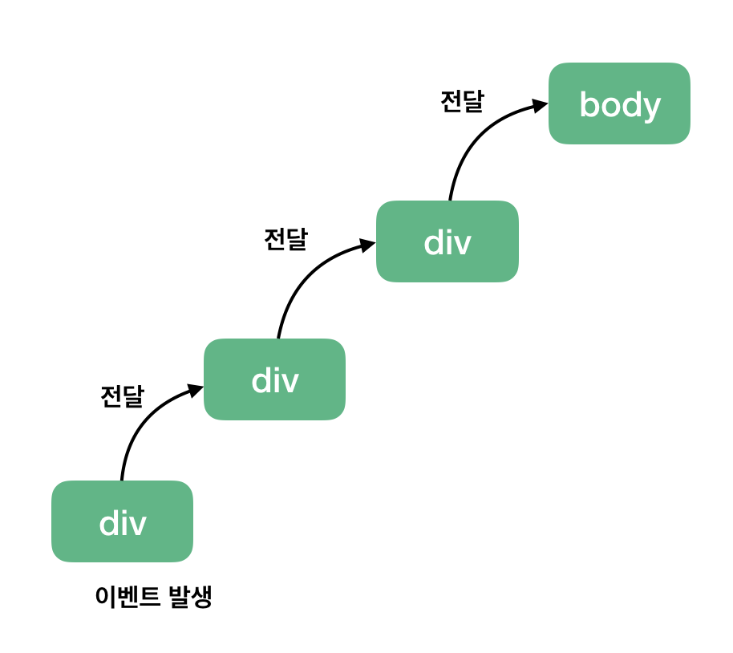
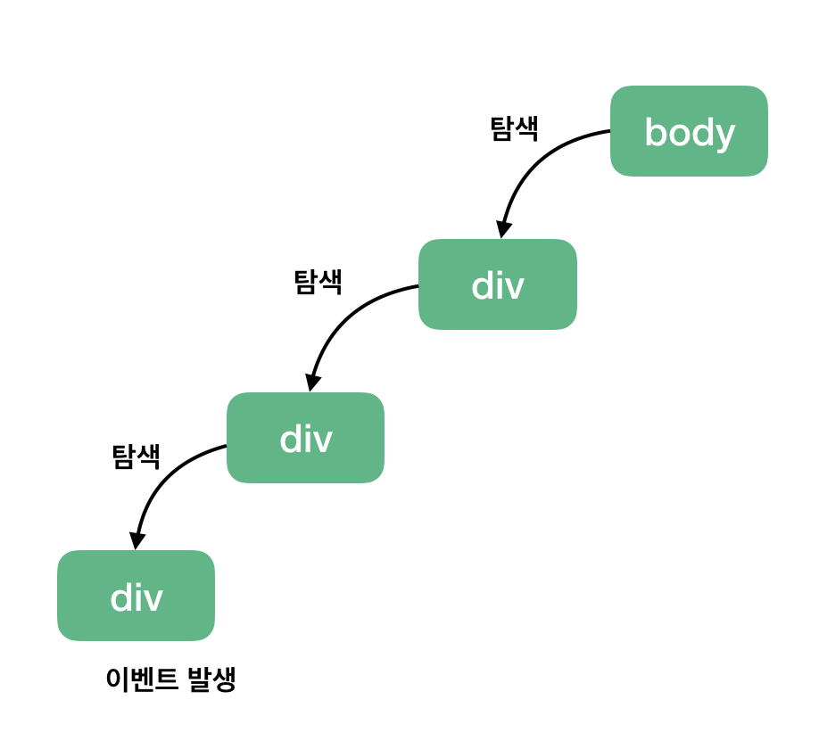
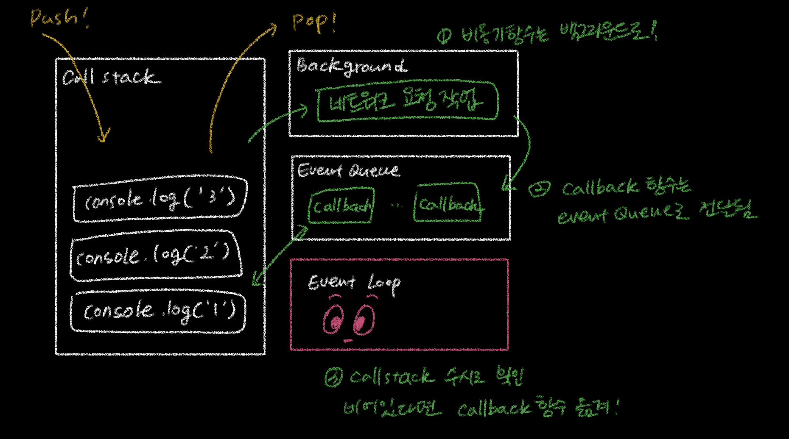

# JavaScript

- [구조 분해 할당 (Destructing assignment)](#구조-분해-할당-destructing-assignment)
- [`const` vs `function`](#const-vs-function)
- [화살표 함수](#화살표-함수)
- [`==` vs `===`](#-vs--equality-operators)
- [클로저](#클로저-closure)
  - [클로저의 활용](#클로저의-활용)
- [`new` 연산자](#new-연산자)
- ['배열 처리 함수'](#배열-처리-함수)
  - [`map()`](#map)
  - [`filter()`](#filter)
  - [`reduce()`](#reduce)
  - [`map(), filter(), reduce()`](#map-filter-reduce)
- [이벤트 버블링](#이벤트-버블링)
- [자바스크립트가 비동기를 처리하는 방법](#자바스크립트가-비동기를-처리하는-방법)

## 구조 분해 할당 (Destructing assignment)

### 구조 분해 할당이란?

- 배열이나 객체의 속성을 해체하여 그 값을 개별 변수에 담을 수 있게 하는 JavaScript 표현식이다.

### 맛보기

코드로 대강 파악해보자.

```javascript
let a, b, rest;
[a, b] = [10, 20];
console.log(a); // 10
console.log(b); // 20

[a, b, ...rest] = [10, 20, 30, 40, 50];
console.log(a); // 10
console.log(b); // 20
console.log(rest); // [30, 40, 50]

({a, b}} = { a: 10, b: 20});
console.log(a); // 10
console.log(b); // 20

({a, b, ...rest} = {a: 10, b: 20, c: 30, d: 40});
console.log(a); // 10
console.log(b); // 20
console.log(rest); // {c: 30, d: 40}
```

### 기본 변수 할당

느낌이 좀 오는지?
<br>먼저 배열 분해를 살펴보자.

```javascript
let x = [1, 2, 3, 4, 5];
let [y, z] = x;
console.log(y); // 1
console.log(z); // 2
```

### 선언에서 분리한 할당

변수 선언이 분리되어도 구조 분해로 값을 할당할 수 있다.

```javascript
let a, b;
[a, b] = [1, 2];
console.log(a); // 1
console.log(b); // 2
```

### 기본값

분해한 값이 `undefined` 라면?
<br>기본값이 없으면 그대로 `undefined`를, 있다면 그 기본값을 대신 사용한다.

```javascript
let a, b;
[a = 5, b = 7] = [1];
console.log(a); // 1
console.log(b); // 7
```

```javascript
let a, b;
[a = 5, b] = [1];
console.log(a); // 1
console.log(b); // undefined
```

```javascript
let a, b;
[a = 5, b] = [];
console.log(a); // 5
console.log(b); // undefined
```

### 변수 교환

하나의 구조 분해 표현식으로 두 변수의 값을 교환할 수 있다.
<br>구조 분해 할당 개념을 찾아보게 된 계기이기도 한! 증말 간단하다.

```javascript
let a = 1;
let b = 2;
[a, b] = [b, a];

console.log(a); // 2
console.log(b); // 1
```

### 함수가 반환한 배열 분석

함수도 구조 분해 할당이 가능하다.

```javascript
function f() {
  return [1, 2];
}

var a, b;
[a, b] = f();
console.log(a); // 1
console.log(b); // 2
```

### 일부 반환값 무시

필요없는 값은 건너뛸 수 있다.

```javascript
function f() {
  return [1, 2, 3];
}

var [a, , b] = f();
console.log(a); // 1
console.log(b); // 3
```

싸그리 무시할 수도 있다.
<br>근데 이런 건 어디에 써먹을라나

```javascript
var [, ,] = f();
```

### 나머지 할당하기

[맛보기](#맛보기)의 rest와 같다.
<br>나머지 요소는 항상 선언된 변수 중 가장 뒤에 위치해야 한다.

```javascript
var [a, ...b] = [1, 2, 3, 4];
console.log(a); // 1
console.log(b); // [2, 3, 4]

var [...c, d] // ❗SyntaxError : 나머지 요소 뒤에 쉼표는 금물
```

### 정규 표현식과 함께 활용해보기

정규 표현식의 exec() 메서드는 일치하는 부분을 찾으면
<br>그 문자열에서 정규식과 일치하는 부분 전체를 배열[0]에,
<br>그 뒤에 정규식에서 ()로 묶인 각 그룹과 일치하는 부분을 포함하는 배열을 반환합니다.
<br>입맛대로 잘 쪼갠 뒤 구조 분해 할당으로 원하는 부분만 챙겨올 수 있겠죠.

```javascript
function letsParse(url) {
  let parsedURL = /^(\w+)\:\/\/([^\/]+)\/(.*)$/.exec(url);
  if (!parsedURL) return false;
  console.log(parsedURL); // ["https://github.com/Study-Mole/study-cs-mole", "https", "github.com", "Study-Mole/study-cs-mole"]

  let [, protocol, fullhost, fullpath] = parsedURL;
  return protocol;
}

console.log(letsParse("https://github.com/Study-Mole/study-cs-mole")); // "https"
```

### 기본 할당

객체 구조 분해이다.

```javascript
let o = { p: 42, q: true };
let { p, q } = o;
console.log(p); // 42
console.log(q); // true
```

### 선언 없는 할당

배열에서 선언 없는 할당이 가능한 것과 같은 맥락이다.
<br>배열 구조 분해와 다르게 할당문을 둘러싼 `(...)`가 필요하다.
<br>이게 없으면 좌변의 { a, b }를 객체 리터럴이 아닌 블록으로 인식해 독립적인 구문이 될 수 없게 된다.

```javascript
let a, b;
({ a, b } = { a: 1, b: 2 });
```

### 기본값

객체로부터 해체된 값이 `undefined`인 경우, 기본값을 할당할 수 있다.

```javascript
let { a = 10, b = 5 } = { a: 3 }; // b는 할당 못받음 ㅠ

console.log(a); // 3
console.log(b); // 5 기본값 줬질옹
```

### 새로운 변수 이름으로 할당하기

속성을 해체하여 원래 속성명을 다른 이름의 변수에 할당할 수 있다.

```javascript
var yubin = { a: 23, c: true };
var { a: age, c: gamja } = yubin;

console.log(age); // 24
console.log(gamja); // true
```

### 중첩된 객체/배열의 구조 분해

살짝 복잡하나, 주석을 잘 따라가보자.

```javascript
let metadata = {
  title: "StudyMole",
  details: [
    {
      locale: "Moles",
      localization_tags: [],
      last_edit: "2024-08-29T14:29:37",
      url: "/Moles/StudyMole",
      title: "Destructing-assignment",
    },
  ],
  url: "/Moles/StudyMole",
};

let {
  title: studyTitle, // metadata의 title을 새로운 변수 studyTitle에 할당
  details: [{ title: topic }], // metadata의 details의 구조를 맞춰주고 내부의 title을 새로운 변수 topic에 할당
} = metadata;

console.log(studyTitle); // "StudyMole"
console.log(topic); // "Destructing-assignment"
```

### for of 반복문과 구조 분해

좀 더 길지만 비교적 간단하다.

```javascript
let moles = [
  {
    name: "yubin",
    age: 23,
    friends: {
      f1: "jomboo",
      f2: "yuna",
      f3: "zhoo",
      f4: "jiyeon",
    },
  },
  {
    name: "yuna",
    age: 27,
    friends: {
      f1: "jomboo",
      f2: "zhoo",
      f3: "yubin",
      f4: "hyehwa",
    },
  },
];

for (let {
  name: n,
  friends: { f4: f },
  age: a,
} of moles) {
  console.log("Name: " + n + ", Age: " + a + ", Friend: " + f);
}

// Name: yubin, Age: 23, Friend: jiyeon
// Name: yuna, Age: 27, Friend: hyehwa
```

### 객체 구조 분해에서 rest

복잡한 건 여까지. 객체 구조 분해에서도 rest 는 같은 방식으로 동작한다.

```javascript
let { a, b, ...rest } = { a: 10, b: 20, c: 30, d: 40 };
console.log(a); // 10
console.log(b); // 20
console.log(rest); // { c: 30, d: 40 }
```

### etc.

평소에 자주 사용하는 아래 예시들도 모두 구조 분해 할당에 해당한다.

**1. 함수의 매개변수 처리**

```javascript
function displayUser({ name, age }) {
  console.log(`Name: ${name}, Age: ${age}`);
}
```

**2. 객체 속성의 빠른 접근**

```javascript
let { username, email } = user;
```

**3. 배열 요소의 추출**

```javascript
let [first, second] = [10, 20];
```

**4. API 응답 처리**

```javascript
let { data, status } = apiResponse;
```

<br>구조 분해 할당은 자바스크립트에서 더 효율적이고 간결하게 코드를 작성하도록 돕는다. 다양한 상황에서 적절히 사용하여 생산성을 높일 수 있다.

## `const` vs `function`

JavaScript에서 함수를 정의할 때 사용하는 대표적인 두 가지 키워드이다.
<br>각 키워드의 개념과 어떤 차이점을 갖는지 간단히 짚어보자.

### `const`

`const` 키워드를 사용하여 함수를 선언하는 것은 **함수 표현식**을 사용하는 것이다.
<br>`const`의 역할은 변수 선언인데, 이 **변수에 익명 함수를 할당하는 방식**으로 함수를 정의한다.

```javascript
const niceToMeetYou = function () {
  console.log("Hello Moles!");
};

niceToMeetYou(); // "Hello Moles!"
```

### `function`

`function` 키워드를 사용하여 함수를 선언하는 것은 **함수 선언식**이라고 부른다.

```javascript
function niceToMeetYou() {
  console.log("Hello Moles!");
}

niceToMeetYou(); // "Hello Moles!"
```

### `const` vs `function`

세 가지 차이점을 갖는다.

**1. 호이스팅**
<br>자바스크립트 인터프리터가 코드를 읽는 방식으로,
<br>스코프(함수) 안에 존재하는 모든 **선언**들을 해당 스코프(함수)의 최상단으로 끌어올리는 것이다.

`const`: **일시적 사각지대(TDZ, Temporal Dead Zone)에 존재** - 선언 전에 접근 불가능

```javascript
niceToMeetYou(); // ❗Uncaught ReferenceError: Cannot access 'niceToMeetYou' before initialization

const niceToMeetYou = function () {
  console.log("Hello Moles!");
};
```

`function`: **호이스팅 ⭕** - 코드 내 어디서든 호출 가능

```javascript
niceToMeetYou(); // "Hello Moles!"

function niceToMeetYou() {
  console.log("Hello Moles!");
}
```

**2. Immutable vs Mutable**

`const`: **Immutable** - 함수 재할당 ❌.

```javascript
const niceToMeetYou = function () {
  console.log("Hello Moles!");
};

niceToMeetYou(); // "Hello Moles!"

niceToMeetYou = function () {
  console.log("Hi Moles!");
}; // ❗Uncaught TypeError: Assignment to constant variable.
```

`function`: **Mutable** - 함수 재할당 ⭕. 의도하지 않게 함수가 변경될 가능성이 있다.

```javascript
function niceToMeetYou() {
  console.log("Hello Moles!");
}

niceToMeetYou(); // "Hello!"

// 다른 함수를 같은 이름으로 선언
function niceToMeetYou() {
  console.log("Hi Moles!");
}

niceToMeetYou(); // "Hi Moles!"
```

**3. 코드 가독성 및 유지보수성**

`const`: 코드를 깔끔하게 작성할 수 있어 가독성 및 유지보수 측면에서 유리하다.

```javascript
const add = (a, b) => a + b;

const multiply = (a, b) => a * b;

console.log(add(2, 3)); // 5
console.log(multiply(2, 3)); // 6
```

`function`: 전통적인 방법으로, 호이스팅이 필요한 상황에서 유용하다.

```javascript
function add(a, b) {
  return a + b;
}

function multiply(a, b) {
  return a * b;
}

console.log(add(2, 3)); // 5
console.log(multiply(2, 3)); // 6
```

### 함수 호이스팅

그렇다면 호이스팅은 언제 필요한 걸까? 예시를 통해 맛만 그냥 살짝 보도록 하자.

**1. Top-Down 코딩 스타일**

코드의 논리적인 순서를 유지하면서도, 함수 정의를 코드의 아래쪽에 위치시킬 수 있다.
<br>이렇게하면 코드의 흐름을 보다 직관적으로 보이도록 배치할 수 있게 된다.

```javascript
function main() {
  initializeApp();
  handleUserInput();
  renderUI();
}

function initializeApp() {
  console.log("App initialized.");
}

function handleUserInput() {
  console.log("Handling user input.");
}

function renderUI() {
  console.log("Rendering UI.");
}

main();
```

**2. Self-contained 모듈 작성**

복잡한 프로그램에서는 코드를 모듈화하여 관리하는 것이 일반적이다.
<br>이때, 모듈의 진입점(Entry Point)을 맨 위에 두고, 그 아래에 모듈에서 사용하는 여러 보조 함수를 정의할 수 있다.
<br>아래 코드에서 `runApp` 함수는 모듈의 진입점 역할, `setup`과 `start` 함수는 보조 역할이다.
<br>함수 호이스팅 덕분에 `runApp` 함수가 먼저 호출되어도 문제없이 동작한다.

```javascript
(function () {
  runApp();

  function runApp() {
    setup();
    start();
  }

  function setup() {
    console.log("Setup complete.");
  }

  function start() {
    console.log("App started.");
  }
})();
```

**3. 재귀 함수의 선언 전 호출**

자신을 호출하는 함수인 재귀 함수의 경우, 함수가 선언되기 전에 호출되는 경우가 잦다.
<br>이를 함수 호이스팅이 지원해준다.

```javascript
console.log(factorial(5)); // 120

function factorial(n) {
  if (n === 1) return 1;
  return n * factorial(n - 1);
}
```

**4. 테스트 및 디버깅**

어떤 함수가 여러 번 호출되는데, 그 함수의 위치가 코드의 맨 아래쪽에 있을 때.
<br>함수 호이스팅을 이용하여 함수 선언 위치의 변경 없이 코드 테스트 또는 디버깅을 할 수 있다.

<br>즉, 함수 호이스팅은 코드의 흐름을 직관적으로 구성하고, 함수 선언의 위치에 구애받지 않고 함수를 호출할 수 있도록 하여 **코드의 가독성과 유지보수성을 높이는 데 활용**된다. 때문에, 함수의 호출 순서가 중요한 경우나, 모듈화된 코드에서 진입점을 먼저 보여주고 싶은 경우에 유용하게 사용할 수 있다. 함수를 정의하는 두 방법의 큰 차이점 중 하나인 호이스팅까지 알아보며 요번 공부를 마친다.

<br/>

## 화살표 함수

이전에는 `function` 키워드를 사용해서 함수를 선언했다. <br/>ES6에서 등장한 화살표 함수는 `=>`를 사용하여 보다 간략한 방법으로 함수를 선언한다.

### 화살표 함수의 호출

화살표 함수는 익명 함수로만 사용할 수 있다. 따라서 화살표 함수를 호출하기 위해서는 함수 표현식을 사용한다.

```javascript
const sayHello = () => console.log("hello mole~");
sayHello(); // hello mole~
```

### 화살표 함수의 this

일반 함수(function)와 화살표 함수(=>)의 가장 큰 차이점은 `this`이다.

function으로 선언한 함수가 메소드로 호출되냐 함수 자체로 호출되냐에 따라 동적으로 this가 바인딩되는 반면, 화살표 함수는 선언될 시점에서의 상위 스코프가 this로 바인딩된다.

### 화살표 함수를 사용하면 안되는 경우

**1. 메소드**
<br/> 메소드로 정의한 화살표 함수의 this는 상위 스코프인 전역 객체 window를 가리킨다.

```javascript
const badMole = {
  name: 'yuna',
  sayHi: () => console.log(`Hi ${this.name}`);
};

badMole.sayHi(); // Hi undefined ❌

// ES6의 축약 메서드 표현 (권장)
const goodMole = {
  name: 'yubin',
  sayHi() {
    console.log(`Hi ${this.name}`);
  }
}

goodMole.sayHi(); // Hi yubin ⭕️
```

<br/>

**2. prototype**
<br/>
화살표 함수로 정의된 메서드를 prototype에 할당하는 경우도 1번과 동일한 문제가 발생한다.

```javascript
const mole = {
  name: "yubin",
};

// 화살표 함수
Object.prototype.sayHi = () => console.log(`Hi ${this.name}`);

mole.sayHi(); // Hi undefined ❌

// 일반 함수
Object.prototype.sayHi = function () {
  console.log(`Hi ${this.name}`);
};

mole.sayHi(); // Hi yubin ⭕️
```

<br/>

**3. 생성자 함수**
<br/>
화살표 함수는 생성자 함수로 사용할 수 없다.
<br/>생성자 함수는 prototype이라는 속성을 가지며 이 속성이 가리키는 프로토타입 객체의 constructor를 사용한다. 하지만 화살표 함수는 이를 가지고 있지 않다.

```javascript
const Foo = () => {};

console.log(Foo.hasOwnProperty("prototype")); // false

const foo = new Foo(); // TypeError: Foo is not a constructor
```

<br/>

**4. addEventListener 함수의 콜백 함수**
<br/>addEventListener 함수의 콜백 함수를 화살표 함수로 정의하면 this는 전역 객체 window를 가리킨다.
<br/>addEventListener 함수의 콜백 함수 내에서 this를 사용하는 경우, 일반 함수를 사용해야 한다. 그 때의 this는 이벤트 리스너에 바인딩된 요소(currentTarget)를 가리킨다.

```javascript
button.addEventListener("click", () => {
  console.log(this === window); // true ❌
  this.innerHTML = "Clicked Button";
});

button.addEventListener("click", function () {
  console.log(this === window); // false ⭕️
  this.innerHTML = "Clicked Button";
});
```

[참고]

- [Arrow funtion | PoiemaWeb](https://poiemaweb.com/es6-arrow-function)

<br>

## `==` vs `===` (Equality Operators)

각각 느슨한 동등 비교와 엄격한 동등 비교를 위해 사용되는 연산자이다.
<br>비슷해 보이지만 사실은 매우 다른 두 개념을 살펴보자.

### `===` (Strict Equality Operator)

엄격한 동등성, 즉 타입과 값이 모두 같은지 비교할 때 사용한다.
<br>`==` 연산자보다 간단한 논리를 거친 결과를 반환하므로 보다 먼저 살펴보자.

같은 타입과 같은 값을 가진 것 사이의 비교이다.
<br>모두 `true`를 반환한다.

```javascript
5 === 5;
// true (모두 숫자, 같은 값)

"hello world" === "hello world";
// true (모두 문자열, 같은 값)

true === true;
// true (모두 불리언, 같은 값)
```

바로 두 번째 예제로 넘어가보자.

```javascript
77 === "77";
// false (숫자와 문자열, 같은 값)

"cat" === "dog";
// false (모두 문자열, 다른 값)

false === 0;
// false (불리언과 숫자, 다른 값)
```

즉, `===`은 타입과 값 중 하나라도 다르면 두 값이 같지 않다고 판단하여 `false`를 반환한다.
<br>아주 직관적인 비교 연산자라고 할 수 있겠다.

### `==` (Abstract Equality Operator)

느슨한 동등성을 비교할 때 사용한다.
<br>강제 형변환(type coercion)을 통해 피연산자들을 공통 타입으로 만든 뒤에, 비교 연산을 수행한다.

`===` 연산자와 비교하여 살펴보자.

```javascript
77 === "77"; // false
77 == "77"; // true

false === 0; // false
false == 0; // true
```

이러한 차이는 강제 형변환에서 나타난다.
<br>자바스크립트가 값을 동등한 타입으로 변환한 후에 값을 비교하기 때문이다.
<br>문자열 `'77'`은 숫자 `77`로, 숫자 `0`은 `falsy`값 `false`로 변환된 것이다.

### `Falsy` 값

`false == 0`이 성립하는 이유는 자바스크립트에서 `0`이란 값이 `falsy` 값이기 때문이다.
<br>`0` 이외에 `false`, `""`, `null`, `undefined`, `NaN` 값이 자바스크립트에서 `falsy` 값에 해당한다.

이번 기회에 아래 비교 규칙들을 암기해두도록 하자.
<br>개인적으론 매번 헷갈리는 것들이다.

`NaN`값이 가장 쉽다.
<br>굉장히 부정적이라고 볼 수 있겄다.

```javascript
false == 0; // true
0 == ""; // true
"" == false; // true

null == null; // true
undefined == undefined; // true
null == undefined; // true

NaN == null; // false
NaN == undefined; // false
NaN == NaN; // false
```

이제 두 변수가 같은지 확인하는, 우리가 일반적으로 원하는 동등 비교 시에는 `===` 연산자를 사용하기로 하자.

[참고]

- [JavaScript — Double Equals vs. Triple Equals](https://codeburst.io/javascript-double-equals-vs-triple-equals-61d4ce5a121a)

<br/>

## 클로저 (Closure)

> A Closure is the combination of a function and the lexical environment within which that function was declared.<br/> _**클로저는 함수와 그 함수가 선언되었을 때의 렉시컬 환경과의 조합이다.**_

너무나도 난해하므로 예제부터 본다.

```javascript
function outerFunc() {
  var x = 10;
  var innerFunc = function () {
    console.log(x);
  };
  innerFunc();
}

outerFunc(); // 10
```

innerFunc는 자신을 포함하고 있는 외부함수 outerFunc의 변수 x에 접근했다.<br/>
스코프는 호출할 때가 아니라 함수를 어디서 선언했는지에 따라 결정된다. 이를 **렉시컬 스코핑(Lexical Scoping)** 이라 한다.

innerFunc는 자신이 속한(= 선언된 곳) 렉시컬 스코프(자신의 스코프, outerFunc, 전역)를 참조할 수 있다.

innerFunc이 호출될 때 스코프 체인은 전역 객체, outerFunc의 활성 객체, innerFunc 자기 자신의 스코프를 가리키는 활성 객체를 순차적으로 바인딩한다. 스코프 체인이 바인딩한 객체가 렉시컬 스코프의 실체이다.

변수 x를 찾는 경우 스코프 체인을 따라 다음과 같은 동작을 한다.

1. innerFunc 함수 스코프에서 변수 x를 검색한다.
2. (1번이 실패한 경우) outerFunc 함수 스코프에서 변수 x를 검색한다.
3. (2번이 실패한 경우) 전역 스코프에서 변수 x를 검색한다.

<br/>

이번엔 outerFunc이 innerFunc을 반환하도록 코드를 수정해보자.

```javascript
function outerFunc() {
  var x = 10;
  var innerFunc = function () {
    console.log(x);
  };
  return innerFunc;
}

/**
 *  함수 outerFunc를 호출하면 내부 함수 innerFunc가 반환된다.
 *  그리고 함수 outerFunc의 실행 컨텍스트는 소멸한다.
 */

var inner = outerFunc();
inner(); // 10
```

outerFunc은 innerFunc을 반환하고 소멸했지만 놀랍게도 innerFunc은 outerFunc의 x를 참조해온다.<br/>
자신을 포함하고 있는 외부함수보다 내부함수가 더 오래 유지되는 경우, <u>**외부함수 밖에서 내부함수가 호출되더라도 외부함수의 지역 변수에 접근할 수 있는데 이러한 함수를 클로저(Closure)라고 한다.**</u>

<br/>

난해했던 정의로 다시 돌아가본다.

> A Closure is the combination of a function and the lexical environment within which that function was declared.<br/> _**클로저는 함수와 그 함수가 선언되었을 때의 렉시컬 환경과의 조합이다.**_

"함수"는 innerFunc을 말하는 것이고 "렉시컬 환경"은 innerFunc이 정의되었던 스코프를 의미한다.

즉, **클로저는 반환된 내부함수가 자신이 선언되었을 때의 환경을 기억하여 자신이 선언된 환경 밖에서 호출되어도 그 환경에 접근할 수 있는 함수를 말한다.**

## 클로저의 활용

### 상태 유지 및 전역 변수 사용 억제

현재 상태를 기억하고 변경된 최신 상태를 유지하는 것은 클로저의 가장 큰 장점이다.

```javascript
var btn = document.querySelector(".btn");

// toggle은 즉시 실행 함수
var toggle = (function () {
  var isShow = false;

  // 1. 클로저 반환
  return function () {
    // 2. 상태 변경
    isShow = !isShow;
  };
})();
// 3. 이벤트 프로퍼티에 클로저 할당
btn.onclick = toggle;
```

1. 즉시 실행 함수는 함수를 반환하고 즉시 소멸한다. toggle이 반환하는 함수는 자신이 생성되었을 때의 렉시컬 환경에 속한 isShow를 기억하는 클로저다.
2. 클로저를 이벤트 핸들러로서 이벤트 프로퍼티에 할당했다. 이를 제거하지 않는 한 렉시컬 환경의 isShow는 소멸하지 않고 현재 상태를 기억한다.
3. 버튼을 클릭하면 클로저가 호출된다. 이 때 isShow의 값이 토글되며 isShow는 클로저에 의해 참조되고 있기 때문에 유효하고 최신 상태를 계속해서 유지한다.

만약 javascript에 클로저가 없다면 이 상태를 유지하기 위해 전역 변수를 사용해야 한다.<br/>

하지만 전역 변수는 누구나 접근 가능하므로 의도치 않은 값의 변경이 일어날 수 있다. 상태 변경이나 가변 데이터를 피하고 불변(immutability)을 지향하는 함수형 프로그래밍에서 side effect를 최대한 억제하여 오류를 피하기 위해 클로저는 적극적으로 사용된다.

### 정보의 은닉

```javascript
function Counter() {
  this.name = "cute mole";
  var counter = 0;

  this.increase = function () {
    return [this.name, ++counter];
  };

  this.decrease = function () {
    return [this.name, --counter];
  };
}

const counter = new Counter();

console.log(counter.name); // cute mole -> 프로퍼티는 인스턴스를 통해 외부에서 접근 가능
console.log(counter.increase()); // [ 'cute mole', 1 ]
console.log(counter.decrease()); // [ 'cute mole', 0 ]
```

생성자 함수 Counter는 increase, decrease 메서드를 갖는 인스턴스를 생성한다.

이 메서드들은 this에 바인딩된 name과 같은 프로퍼티 뿐만 아니라 자신이 생성했을 때의 렉시컬 환경에 속한 변수 counter를 기억하고 서로 공유한다.

이 때 생성자 함수 Counter의 변수 counter는 this에 바인딩된 프로퍼티가 아니라 변수이다.
this에 바인딩된 프로퍼티라면 생성한 인스턴스를 통해 외부에서 접근 가능한 `public` 프로퍼티가 되지만 변수 counter는 접근 불가능 하다.
<br/>

하지만 생성자 함수 Counter로 생성한 인스턴스의 메서드인 increase, decrease는 클로저이기 때문에 자신이 생성되었을 때의 렉시컬 환경에 속한 변수인 counter에 접근할 수 있다.
이러한 클로저의 특징을 이용해 클래스 기반 언어의 `private`키워드를 흉내낼 수도 있다.

[참고]

- [Closure | PoiemaWeb](https://poiemaweb.com/js-closure)

<br>

## `new` 연산자

사용자 정의 객체 타입 또는 내장 객체 타입의 인스턴스를 생성하는 연산자이다.
<br>아래와 같은 형태를 갖는다.

```javascript
new constructor[[arguments]]();
```

- `constructor`: 객체 인스턴스의 타입을 기술하는 함수
- `arguments`: `constructor`와 함께 호출될 값 목록

<br>그러니까 대충 이런 식으로 쓰는거다.

```javascript
function Mole(name, age, height) {
  this.name = name;
  this.age = age;
  this.height = height;
}

const yubin = new Mole("yubin", 25, 165);

console.log(yubin.height); // 165
```

### 사용자 정의 객체

`new` 연산자는 함수(생성자 함수)를 통해 새로운 객체를 생성할 때 사용한다.
<br>`new`를 통해 생성된 객체는 해당 함수의 `prototype`을 상속받는다.
<br>이 때, 생성자 함수 내에서 `this`는 생성된 새 객체를 가리킨다.

객체를 생성하는 과정을 단계별로 정리하면 다음과 같다.

- 새 객체 생성: `new`는 먼저 `Mole.prototype`을 상속하는 새로운 객체를 만든다.
- 생성자 함수 호출: 생성자 함수 `Mole`이 호출되고, 그 안의 `this`는 새로 만들어진 객체를 가리킨다. 생성자 함수에서 속성 등을 설정할 수 있다.
- 객체 반환: 생성자 함수가 명시적으로 객체를 반환하지 않으면, 기본적으로 생성된 객체를 반환한다.

<br>

```javascript
function Mole(name, age) {
  this.name = name;
  this.age = age;
  this.describe = function () {
    return `This mole is ${this.name}. And she is ${this.age}.`;
  };
}

const myMole = new Mole("yubin", "25");
console.log(myMole.describe()); // "This mole is yubin. And she is 25."
```

위 코드에서 `new Mole('yubin', '25');`가 실행되면, `Mole.prototype`을 상속하는 새 객체가 생성된다.
<br>`Mole` 함수가 호출되며, `this`는 새로 만들어진 객체를 가리킨다. `this.name`과 `this.age` 속성에 값이 할당된다.
<br>생성된 객체가 `myMole` 변수에 할당된다.

<br>

### 속성이 또 다른 객체일 때

```javascript
function Mole(mind) {
  this.mind = mind;
}

function Person(sex, name, mole) {
  this.sex = sex;
  this.name = name;
  this.mole = mole; // Mole 객체를 속성으로 가짐
  this.describe = function () {
    return `${this.sex} is ${this.name} with ${this.mole.mind} mind.`;
  };
}

let myMole = new Mole("strong"); // Mole 객체 생성
let myPerson = new Person("She", "yuna", myMole); // Person 객체 생성, Mole 포함

console.log(myPerson.describe()); // "She is yuna with strong mind."
```

1. `Mole`이라는 객체가 따로 있고, `Person` 객체는 `Mole` 객체를 속성으로 가질 수 있다.
2. `myMole`이라는 `Mole` 객체를 만들고, 이를 `myPerson`이라는 `Person` 객체의 속성으로 전달한다.

<br>

### 이전에 정의된 객체에 속성을 추가할 때

```javascript
function Mole() {}
yuna = new Mole();
yubin = new Mole();

console.log(yuna.run); // undefined

Mole.prototype.run = "Tancheon";
console.log(yuna.run); // Tancheon

yubin.run = "Hokey";
console.log(yubin.run); // Hokey

console.log(yuna.__proto__.run); //Tancheon
console.log(yubin.__proto__.run); //Tancheon
console.log(yuna.run); // Tancheon
console.log(yubin.run); // Hokey
```

공유 속성을 추가할 때는 `.prototype` 속성을 사용한다. 이는 객체 타입의 인스턴스 하나에만 적용되는 것이 아니라 이 함수로 생성하는 모든 객체와 공유하는 속성을 정의하게 된다.

이와 다르게 한 객체에 추가한 속성은 다른 객체들에게는 영향을 주지 않는다.
<br>동일한 타입의 모든 객체들에게 새로운 속성을 추가하려면, `Mole` 객체 타입의 정의에 이 속성을 추가해야한다.

이렇게 `new` 연산자를 통해 다양한 객체를 생성하고, 속성으로 다른 객체를 포함하는 방식으로 객체 지향 프로그래밍을 구현할 수 있다.

[참고]

- [new operator | mdn web docs](https://developer.mozilla.org/ko/docs/Web/JavaScript/Reference/Operators/new)

<br>

## 배열 처리 함수

### 함수형 프로그래밍

함수형 프로그래밍은 함수의 출력 값이 오직 함수로 전달된 인자에만 의존하는 프로그래밍 패러다임으로, 동일한 인자를 사용해 함수를 호출하면 항상 같은 결과를 반환한다.
<br>이를 **참조 투명성**이라고 하며, 함수형 프로그래밍의 핵심 개념 중 하나이다.

배열 처리 함수 `map()`, `filter()`, `reduce()`는 배열을 변형하거나 처리할 때, 상태를 변경하지 않고 입력된 배열의 복사본을 기반으로 동작하며, 원본 배열을 변경하지 않기 때문에 `순수 함수`의 개념에 부합하다.
<br>이를 통해 함수 실행마다 예측 가능한 결과를 얻을 수 있다.

전통적인 명령형 프로그래밍에서는 전역 변수나 로컬 변수를 사용해 상태를 변경하는데, 이는 side-effect를 발생시킬 가능성을 높인다.
<br>함수 실행 결과가 매번 다르면 코드의 동작을 이해하고 디버깅하기 어려워진다.
<br>배열 처리 함수들은 이러한 부수 효과를 제거하면서, 복잡한 로직을 간결하게 구현할 수 있도록 도와준다.

## `map()`

클라이언트는 서버로부터 받은 데이터를 변환해 사용하는 경우가 많다.
<br>`map`은 배열의 각 요소를 다른 값으로 변환하여 새로운 배열을 생성하며, 주로 배열의 요소를 다른 형태로 변환할 때 사용된다.

### 사용법

`map`은 인자로 콜백을 받는다. map이 호출될 때, 이 콜백에 현재 **값의 iteration, iteration의 index** 그리고 **원본 배열**이 주어진다.
<br>map을 위한 optional한 두 번째 인자도 있다. 이는 콜백 내부에서 **this**를 이용하기 위한 값이다.

```javascript
const nums = [1, 2, 3];
const doubled = nums.map((num, index, array) => {
  return num * 2;
});

console.log(doubled); // [2, 4, 6]
```

### 예제

아래 자바스크립트 오브젝트 배열이 있다고 하자.

```javascript
const Moles = [
  { id: 1, name: "jomboo", position: "first" },
  { id: 2, name: "yuna", position: "second" },
  { id: 3, name: "zhoo", position: "third" },
  { id: 4, name: "yubin", position: "na" },
];
```

name 값만 모아보자.

```javascript
const allMoleNames = Moles.map((Mole) => {
  return Mole.name;
});

console.log(allMoleNames); // ["jomboo", "yuna", "zhoo", "yubin"];
```

유틸 함수도 껴볼 수 있다.

```javascript
const upperCaseMoles = Moles.map(myMoleFunc);

const myMoleFunc = (Mole) => {
  return Mole.name.toUpperCase();
};

console.log(upperCaseMoles); // ["JOMBOO","YUNA","ZHOO","YUBIN"];
```

프로퍼티를 삭제하거나 추가해보자.

```javascript
const mapped = Moles.map((Mole) => {
  const { position, ...rest } = Mole;

  return {
    ...rest,
    ThisMoleIs: "CoolAndWarm",
  };
});

console.log(mapped);
// [
//   { id: 1, name: "jomboo", ThisMoleIs: "CoolAndWarm" },
//   { id: 2, name: "yuna", ThisMoleIs: "CoolAndWarm" },
//   { id: 3, name: "zhoo", ThisMoleIs: "CoolAndWarm" },
//   { id: 4, name: "yubin", ThisMoleIs: "CoolAndWarm" },
// ];
```

## `filter()`

배열의 각 요소에 대해 조건을 평가한 후, 조건에 맞는 요소들만을 포함하는 새로운 배열을 생성한다.

### 사용법

`filter`는 map과 동일한 인자를 받으며, 비슷하게 동작한다.
<br>유일한 차이점은 콜백 함수가 `true` 또는 `false`를 반환하는 것이다.
<br>`true`를 반환하면 해당 원소가 배열에 남고, `false`이면 필터링되어 제거된다.

```javascript
const nums = [1, 2, 3, 4];
const even = nums.filter((num, index, array) => {
  return num % 2 === 0;
});

console.log(even); // [2, 4]
```

### 예제

간단한 문자열 검색허기

```javascript
const strings = ["hello", "Matt", "Mastodon", "Cat", "Dog"];

const filtered = strings.filter((str) => {
  return str.includes("at");
});

console.log(filtered); // ["Matt", "Cat"];
```

`Moles`에서 나를 찾아보자.

```javascript
const naMole = Moles.filter((Mole) => {
  return Mole.position.toUpperCase() === "NA";
});

console.log(naMole);
```

## `reduce()`

배열 하나를 받아서 하나의 값으로 바꿔준다.

### 사용법

`map`, `filter`와 비슷하게 동작한다. 콜백 인자로 **accumulator**를 받는다는 점에서 차이가 있다.
<br>모든 반환 값을 누적하는 역할으로, `reduce` 함수의 두 번째 인자 값이 accumulator 초기값이다.

```javascript
const nums = [1, 2, 3, 4];
const sum = nums.reduce((acc, curr) => {
  return acc + curr;
}, 0);
const avg = sum / nums.length;

console.log(sum); // 10
console.log(avg); // 2.5
```

### 예제

새로운 `Moles` 자바스크립트 오브젝트 배열을 가져왔다.

```javascript
const Moles = [
  { id: 1, name: "jomboo", team: "fa" },
  { id: 2, name: "yuna", team: "bi" },
  { id: 3, name: "zhoo", team: "tb" },
  { id: 4, name: "yubin", team: "fa" },
];
```

..어디 들어들있는지 알아보자.

```javascript
const obj = Moles.reduce((acc, curr) => {
  const team = curr.team;
  const teamCount = acc[team] ? acc[team] + 1 : 1;

  return {
    ...acc,
    [team]: teamCount,
  };
}, {});

console.log(obj); // { "fa": 2, "bi": 1, "tb": 1};
```

새로운 두더지가 들어왔다.

```javascript
const newMoles = [Moles, [{ id: 5, name: "hanbin", team: "banggoo" }]];

const flatnewMoles = newMoles.reduce((acc, curr) => {
  return acc.concat(curr);
}, []);

console.log(flatnewMoles);
// [
//   { id: 1, name: "jomboo", team: "fa" },
//   { id: 2, name: "yuna", team: "bi" },
//   { id: 3, name: "zhoo", team: "tb" },
//   { id: 4, name: "yubin", team: "fa" },
//   { id: 5, name: "hanbin", team: "banggoo" },
// ]
```

## `map(), filter(), reduce()`

위의 세 함수를 연계하여 사용할 수 있다.

### 사용법

2의 배수만 필터링하고, 각 요소를 제곱하여, 총합을 구해보자.

```javascript
const numbers = [1, 2, 3, 4, 5];

const result = numbers
  .filter((num) => num % 2 === 0) // 2의 배수 필터링
  .map((num) => num ** 2) // 각 요소 제곱
  .reduce((acc, curr) => acc + curr, 0); // 총합 계산

console.log(result); // 20
```

### 예제

조금 더 복잡한 배열을 가져왔다. 각각의 노래는 초로 표기된 길이를 갖는다.

```javascript
const day6Songs = [
  { id: 1, name: "nothing but", artist: "Young K", duration: 208 },
  { id: 2, name: "Unpainted Canvas", artist: "WONPIL", duration: 229 },
  { id: 3, name: "How to love", artist: "Day6", duration: 204 },
  {
    id: 4,
    name: "Right Through Me",
    artist: "Day6 (Even of Day)",
    duration: 218,
  },
];

const btobSongs = [
  { id: 1, name: "SWIMMING", artist: "임현식", duration: 261 },
  { id: 2, name: "AT THE END", artist: "이창섭", duration: 230 },
  { id: 3, name: "Dear My Dear", artist: "서은광", duration: 269 },
  { id: 4, name: "BE SOMEBODY", artist: "육성재", duration: 183 },
];
```

200초가 넘는 모든 노래의 제목을 컴마로 구분하는 배열을 가져와야 한다면?

```javascript
const allSongs = [day6Songs, btobSongs];

const songNames = allSongs
  // 배열 평탄화. const allSongs = [...day6Songs, ...btobSongs];와 같다.
  .reduce((acc, curr) => {
    return acc.concat(curr);
  }, [])
  // 200초 이상 노래 필터링
  .filter((song) => song.duration > 200)
  // 노래 이름만 추출
  .map((song) => song.name)
  // 컴마로 구분된 문자열 생성
  .join(", ");

console.log(songNames); // nothing but, Unpainted Canvas, How to love, Right Through Me, SWIMMING, AT THE END, Dear My Dear
```

### 연계의 이유

`map`, `filter`, `reduce`를 함께 사용하면 `array[i]`와 같은 형식보다 현재 값에 직접 접근하기 쉬워진다.
<br>기존 배열의 변화를 방지하여 side-effect를 최소화할 수 있으며, `for 문`을 관리할 필요가 없어지고 빈 배열을 생성해 push할 필요도 없어진다.

### 결론

배열 처리 함수는 원본 배열을 변경하지 않으면서 데이터를 간결하고 직관적으로 변형하고 집계할 수 있는 강력한 도구이다.
<br>함수형 프로그래밍의 원칙을 잘 반영하여 side-effect를 최소화하고 코드의 가독성을 향상시키는 데 강점을 갖는다.

[참고]

- [Learn map, filter and reduce in Javascript](https://medium.com/@joomiguelcunha/learn-map-filter-and-reduce-in-javascript-ea59009593c4)

<br>

## 이벤트 버블링

HTML 문서의 각 요소들은 태그 안에 태그가 위치하는 **계층적** 형식을 보인다.<br/>
이러한 계층적 구조 때문에 특정 요소에 이벤트가 발생할 경우 연쇄적 이벤트 흐름이 일어나게 된다.

이러한 현상을 이벤트 전파(Event Propagation)라 하며, 전파 방향에 따라 두 가지로 구분된다.

1. 버블링(Bubbling): 자식 태그에서 발생한 이벤트가 부모 태그로 전파
2. 캡처링(Capturing): 자식 태그에서 발생한 이벤트가 부모 태그부터 시작하여 안쪽 자식 태그로 전파

|  |  |
| -------------------------------------------- | ---------------------------------------------- |

### 이벤트 버블링

버블링이란 한 태그에 이벤트가 발생하면 이 태그에 할당된 핸들러가 동작하고, 이어서 부모 태그의 핸들러가 동작하고 최상단의 태그를 만날 때까지 반복되면서 핸들러가 동작하는 현상을 말한다. <br/>
이벤트가 제일 깊은 속에 있는 태그에서 시작해 부모 태그를 거슬러 올라가며 발생하는 모양이 마치 거품과 닮아있다.

```HTML
<body>
  <div class="DIV1">DIV 1
    <div class="DIV2">DIV 2
      <div class="DIV3">DIV 3</div>
    </div>
  </div>
</body>
```

```javascript
const divs = document.querySelectorAll("div");

const clickEvent = (e) => {
  console.log(e.currentTarget.className);
};

divs.forEach((div) => {
  div.addEventListener("click", clickEvent);
});
```

JavaScript는 기본적으로 버블링이 발생하기 때문에 `DIV3`을 클릭한다면 `DIV3` -> `DIV2` -> `DIV1`의 순서대로 이벤트가 전파된다.

> 거의 모든 이벤트는 버블링이 된다.
> <br/> 다만, focus 이벤트와 같이 버블링 되지 않는 이벤트도 존재한다.

### 이벤트 캡처링

캡처링은 버블링과는 반대로 최상위 태그에서 이벤트가 발생한 태그를 찾아 내려간다.<br/>
아래와 같이 구현할 수 있지만 자주 사용되는 개념은 아니다.

```javaScript
const divs = document.querySelectorAll("div");

const clickEvent = (e) => {
  console.log(e.currentTarget.className);
}

divs.forEach((div) => {
  div.addEventListener("click", clickEvent, { capture: true });
})
```

`addEventListener`의 옵션 객체에 `{ capture: true }`또는 true를 설정해주면 된다.
캡처링의 경우 `DIV3`을 클릭한다면 `DIV1` -> `DIV2` -> `DIV3`이 순서대로 출력된다.

### 이벤트 전파 막기

코드를 작성하다 보면 이벤트 전파를 막아야 하는 경우가 존재한다.<br/>

`event.stopPropagation()`을 사용하면 클릭한 태그의 이벤트만 발생하고 상위 태그로 이벤트가 전파되는 것을 막을 수 있다.

아래의 코드를 실행하면 `DIV3`의 이벤트만 실행된다.

```javaScript
const clickEvent = (e) => {
    e.stopPropagation();
    console.log(e.currentTarget.className);
}
```

<br/>

[참고]

- [이벤트 버블링과 캡처링에 대한 정리](https://velog.io/@tlatjdgh3778/%EC%9D%B4%EB%B2%A4%ED%8A%B8-%EB%B2%84%EB%B8%94%EB%A7%81%EA%B3%BC-%EC%BA%A1%EC%B2%98%EB%A7%81%EC%97%90-%EB%8C%80%ED%95%9C-%EC%A0%95%EB%A6%AC)
- [이벤트 버블링, 이벤트 캡쳐 그리고 이벤트 위임까지](https://joshua1988.github.io/web-development/javascript/event-propagation-delegation/)
- [한눈에 이해하는 이벤트 흐름 제어 (버블링 & 캡처링)](https://inpa.tistory.com/entry/JS-%F0%9F%93%9A-%EB%B2%84%EB%B8%94%EB%A7%81-%EC%BA%A1%EC%B3%90%EB%A7%81)

## 자바스크립트가 비동기를 처리하는 방법

JavaScript는 한번에 하나의 작업만 수행이 가능한 single thread 기반 언어이다.<br/>
하나의 작업이 수행 중이면, thread는 block 된다는 뜻이다.

간단한 함수 실행에 있어서는 이 thread block을 체감하기 어렵지만 네트워크 요청, DB Query, 파일 시스템 제어 등 시간이 오래 걸리는 작업도 있다. 이는 자원 낭비와 사용성 저하로 이어질 수 있기 때문에 thread를 block 하지 않고 사용할 수 있는 방법이 필요하다.

다행히 JavaScript 엔진은 긴 시간이 소요되는 작업을을 main thread에서 수행하지 않는다. 이러한 작업들은 백그라운드라는 공간에 옮겨져 실행된다. 이렇게 백그라운드에서 실행되는 작업들을 '비동기 작업'이라 부른다.

### callback 함수

main thread에서 비동기 함수를 만나면 백그라운드로 위임한다. <br/>
백그라운드에서 작업이 완료되면, main thread는 수행 결과를 알 수 있어야 한다. (위임한 친구에게 다시 알려줘야 하니까..)
동시에 main thread 입장에서 함수 호출이 성공했을때는 A, 실패했을 때는 B와 같이 처리하고 싶을 수 있다. <br/>
그래서 우리는 비동기 함수를 호출할 때 처리 완료 시 main thread에서 수행할 함수를 함께 전달하는 데, 이 함수를 callback 함수라고 한다.

정리하자면, callback 함수는 **"비동기 작업이 완료되었을 때 main thread에서 실행할 함수"** 이다.

### Event Loop

callback 함수는 백그라운드로 보내졌다가 다시 main thread 안으로 들어온 뒤 실행된다. <br/> 그러나, main thread와 백그라운드는 별도의 프로세스이기 때문에 callback 함수가 돌아와야 하는 시점에 main thread에서는 다른 작업이 수행되고 있을 수 있다.

**callback 함수가 돌아오는 시점을 정해주는 체계가 필요하고, 이 역할을 Event Loop가 담당한다.**

### Event Loop의 동작 원리

main thread에서 실행되는 모든 함수들은 call stack이라는 공간에 LIFO 형태로 쌓이게 된다.<br/>
함수가 호출되면 push되고, 함수 실행이 종료되면 pop이 되는 단순한 구조이다.<br/>

만약 call stack에 비동기 함수가 들어오면 즉시 pop하여 백그라운드로 전달한다. <br/> 비동기 함수가 백그라운드에서 처리되는 동안 call stack에서는 다음 함수가 계속 실행되고 있기 때문에 single thread blocking 문제를 해결할 수 있다.

이후, 백그라운드에서 비동기 처리가 완료되면, 호출 시점에 전달한 callback 함수가 Event Queue에 FIFO 구조로 쌓인다.<br/> Event Queue에 있는 callback 함수를 call stack으로 옮겨주는 역할을 Event Loop가 담당한다.

Event Loop는 call stack이 완전히 비어있는지 수시로 확인하고, 비어있는 경우 Event Queue의 callback 함수를 call stack으로 shift 한다.

요약하자면,



1. call stack에 들어온 비동기 함수는 백그라운드로 옮겨져 실행된다.
2. 비동기 함수의 처리가 완료되면 callback 함수들은 Event Queue에 FIFO 구조로 쌓인다.
3. Event Loop는 call stack을 수시로 확인하면서, 비어있는 경우 Event Queue에 쌓인 callback 함수를 call stack에 push한다.

single thread 기반 언어인 JavaScript가 비동기 함수를 어떻게 처리하는 지에 대해서 알아보았다.
이후에는 callback 함수의 진화 버전인 Promise와 async/await가 등장한다.
