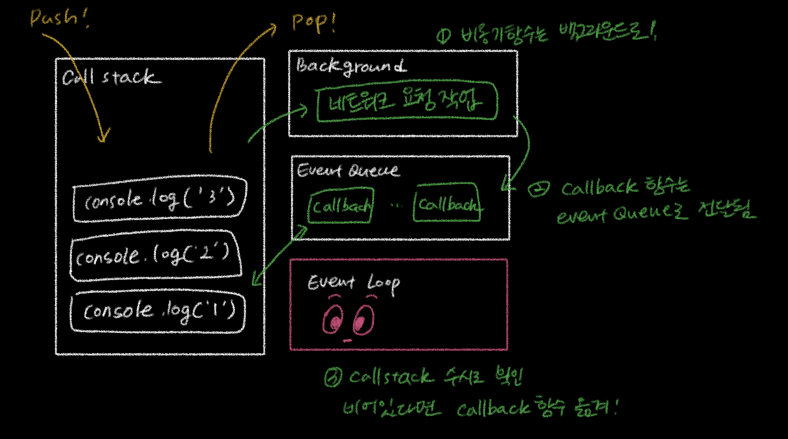

## 자바스크립트가 비동기를 처리하는 방법

JavaScript는 한번에 하나의 작업만 수행이 가능한 single thread 기반 언어이다. 
하나의 작업이 수행 중이면, thread는 block 된다는 뜻이다.

간단한 함수 실행에 있어서는 이 thread block을 체감하기 어렵지만 네트워크 요청, DB Query, 파일 시스템 제어 등 시간이 오래 걸리는 작업도 있다. 이는 자원 낭비와 사용성 저하로 이어질 수 있기 때문에 thread를 block 하지 않고 사용할 수 있는 방법이 필요하다.

다행히 JavaScript 엔진은 긴 시간이 소요되는 작업을을 main thread에서 수행하지 않는다. 이러한 작업들은 백그라운드라는 공간에 옮겨져 실행된다. 이렇게 백그라운드에서 실행되는 작업들을 '비동기 작업'이라 부른다.

### callback 함수

main thread에서 비동기 함수를 만나면 백그라운드로 위임한다.  
백그라운드에서 작업이 완료되면, main thread는 수행 결과를 알 수 있어야 한다. (위임한 친구에게 다시 알려줘야 하니까..)
동시에 main thread 입장에서 함수 호출이 성공했을때는 A, 실패했을 때는 B와 같이 처리하고 싶을 수 있다.  
그래서 우리는 비동기 함수를 호출할 때 처리 완료 시 main thread에서 수행할 함수를 함께 전달하는 데, 이 함수를 callback 함수라고 한다.

정리하자면, callback 함수는 **"비동기 작업이 완료되었을 때 main thread에서 실행할 함수"** 이다.

### Event Loop

callback 함수는 백그라운드로 보내졌다가 다시 main thread 안으로 들어온 뒤 실행된다.   그러나, main thread와 백그라운드는 별도의 프로세스이기 때문에 callback 함수가 돌아와야 하는 시점에 main thread에서는 다른 작업이 수행되고 있을 수 있다.

**callback 함수가 돌아오는 시점을 정해주는 체계가 필요하고, 이 역할을 Event Loop가 담당한다.**

### Event Loop의 동작 원리

main thread에서 실행되는 모든 함수들은 call stack이라는 공간에 LIFO 형태로 쌓이게 된다. 
함수가 호출되면 push되고, 함수 실행이 종료되면 pop이 되는 단순한 구조이다. 

만약 call stack에 비동기 함수가 들어오면 즉시 pop하여 백그라운드로 전달한다.   비동기 함수가 백그라운드에서 처리되는 동안 call stack에서는 다음 함수가 계속 실행되고 있기 때문에 single thread blocking 문제를 해결할 수 있다.

이후, 백그라운드에서 비동기 처리가 완료되면, 호출 시점에 전달한 callback 함수가 Event Queue에 FIFO 구조로 쌓인다.  Event Queue에 있는 callback 함수를 call stack으로 옮겨주는 역할을 Event Loop가 담당한다.

Event Loop는 call stack이 완전히 비어있는지 수시로 확인하고, 비어있는 경우 Event Queue의 callback 함수를 call stack으로 shift 한다.

요약하자면,

1. call stack에 들어온 비동기 함수는 백그라운드로 옮겨져 실행된다.
2. 비동기 함수의 처리가 완료되면 callback 함수들은 Event Queue에 FIFO 구조로 쌓인다.
3. Event Loop는 call stack을 수시로 확인하면서, 비어있는 경우 Event Queue에 쌓인 callback 함수를 call stack에 push한다.

single thread 기반 언어인 JavaScript가 비동기 함수를 어떻게 처리하는 지에 대해서 알아보았다.
이후에는 callback 함수의 진화 버전인 Promise와 async/await가 등장한다.
