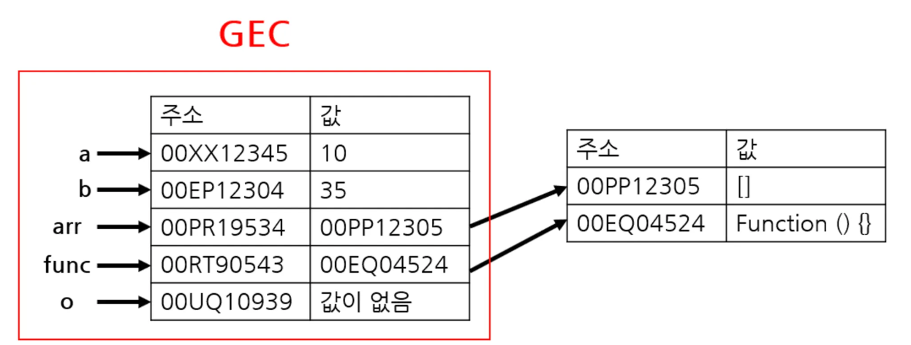
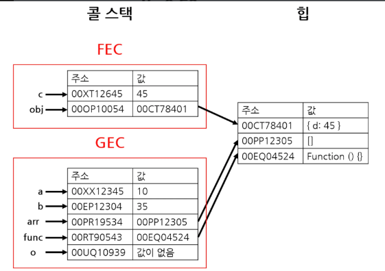
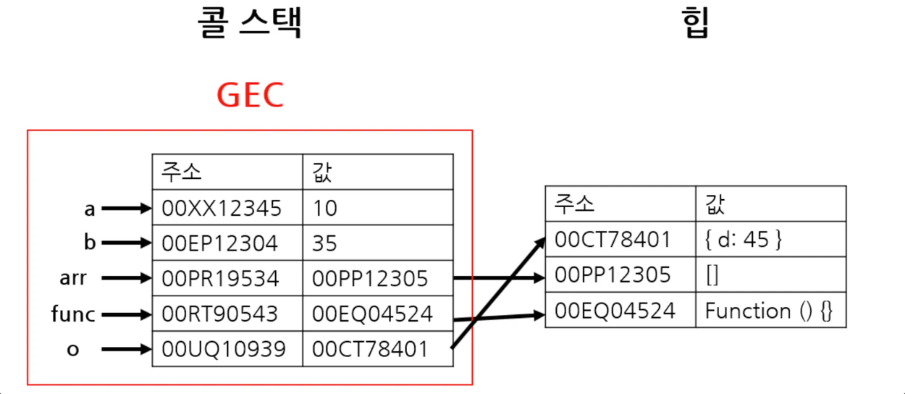
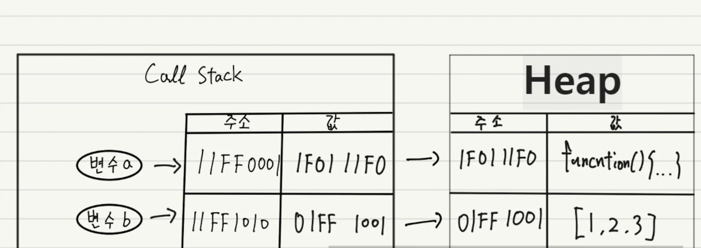
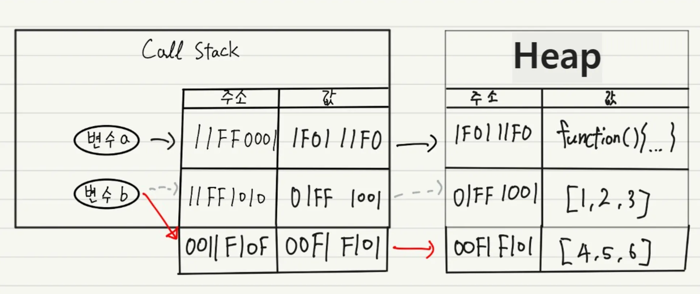
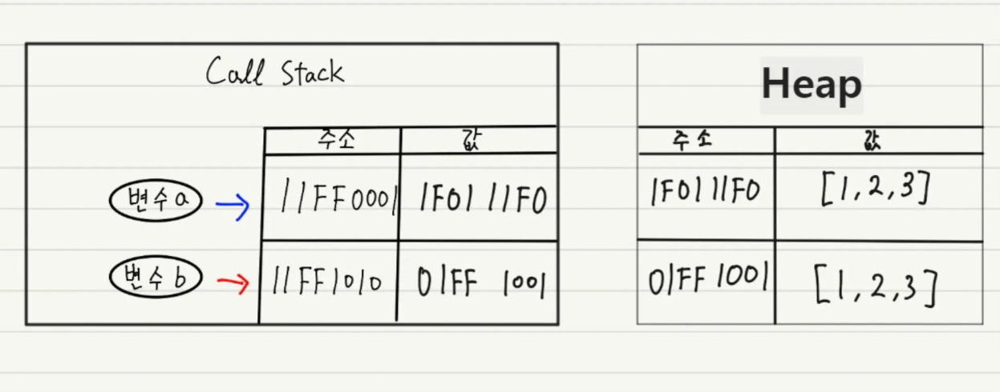

# 콜 스택과 메모리 힙

### 정의

### 콜스택

원시 타입 값과 함수 호출의 실행 컨텍스트를 저장하는 곳이다.

### 힙(메모리 힙)

객체, 배열, 함수와 같이 크기가 동적으로 변할 수 있는 참조타입 값을 저장하는 곳이다.

### 동작원리

```js
let a = 10;
let b = 35;
let arr = [];

function func() {
  const c = a + b;
  const obj = { d: c };
  return obj;
}

let o = func();
```

위 코드를 **콜 스택과 힙**의 동작으로 확인해 보면

제일 처음으로 GEC(Global Execution Context, 글로벌 실행 컨텍스트)가 생성되고

원시 값은 콜스택에, 참조 값은 힙에 저장된다.



- 이때 참조값은 힙에 저장되며 콜 스택에는 힙의 주소가 저장된다.

GEC가 생성된 뒤 함수가 실행하게 되고 FEC(Function Execution Context, 함수 실행 컨텍스트)가 생성되며 동일하게 원시 값은 콜 스택에, 참조값은 힙에 저장된다.



- 참조값은 힙에 저장된 뒤 힙의 주소를 콜스텍에 저장한다.

함수가 객체object 를 리턴하면 힙에 해당 값을 저장후 FEC에 힙 메모리 주소를 저장한다. 그후 o에 함수에서 반환된 객체값을 할당하면 아래와 같다.


FEC는 함수가 값을 리턴했기 때문에 콜 스택에서 제거된다.
이제 콜 스택에 있는 o의 값은 객체 값이 저장된 힙 메모리 주소로 갖게된다.

전체 코드 실행이 끝나면 GEC가 콜 스택에서 제거된다.
GEC가 제거되면, 힙의 객체를 참조하는 스택의 값이 없기 때문에
가비지 컬렉션(Garbage Collector, GC)에 의해 제거된다.

---

### 변수 데이터 할당과 재할당

원시 타입은 string,number,boolean,undefined,null등이 있다.

### 할당

이값들은 콜 스택에 직접적으로 저장되며 코드에서 변수를 참조를 할 경우 콜 스택에서 바로 해당값을 가져올수 있다.

### 재할당

재할당의 경우 본인의 메모리에 있는 값을 변경하는 것이 아닌, 기존의 값을 저장하고 있는 메모리의 주소 값으로 교체한다.

---

### 참조값

### 할당



- 참조 값은 메모리 힙에 저장되며, 메모리 힙 주소값은 콜 스택에 저장되고 , a와 b에는 해당 콜 스택의 주소값이 저장된다.

**값 변경**

변수에 값을 재할당한 것이 아니라, 변수에 저장된 데이터를 수정한 것이다.

값 변경의 경우는 위의 사진에서 데이터를 수정한 것이기 때문에 힙의 주소는 같다.

즉, 콜 스택에 저장된 힙의 주소는 변하지 않는다.

### 재할당



재할당의 경우에는 새로운 힙 주소가 생기며 새로운 데이터가 저장된다.
콜 스택에 저장된 힙 주소 또한 바꿔야 하므로 새로운 메모리를 확보해 새로운 콜 스택 주소도 생기게 된다.

참조 값은 동일한 구성의 객체를 생성해도 매번 새 메모리를 확보해 새 데이터를 생성한다.

### 동일한 구성의 참조 값 데이터



객체와 같은 참조 값은 동적으로 내부 요소가 변경될 수 있으므로,
동일한 요소의 객체를 생성해도 메모리힙에 별도의 메모리 공간을 확보해 저장하게 된다.
즉, a !== b인 셈이다.

[참고]

- [콜스택과 힙](https://58cjdcns99.tistory.com/entry/%EC%BD%9C-%EC%8A%A4%ED%83%9DCall-stack%EA%B3%BC-%ED%9E%99Heap-%EA%B7%B8%EB%A6%AC%EA%B3%A0-%EB%A9%94%EB%AA%A8%EB%A6%AC-%EB%88%84%EC%88%98-%EA%B0%80%EB%B9%84%EC%A7%80-%EC%BB%AC%EB%A0%89%EC%85%98%EC%9D%84-%EA%B3%81%EB%93%A4%EC%9D%B8)

[이미지 출처]

- [콜스택과 힙](https://58cjdcns99.tistory.com/entry/%EC%BD%9C-%EC%8A%A4%ED%83%9DCall-stack%EA%B3%BC-%ED%9E%99Heap-%EA%B7%B8%EB%A6%AC%EA%B3%A0-%EB%A9%94%EB%AA%A8%EB%A6%AC-%EB%88%84%EC%88%98-%EA%B0%80%EB%B9%84%EC%A7%80-%EC%BB%AC%EB%A0%89%EC%85%98%EC%9D%84-%EA%B3%81%EB%93%A4%EC%9D%B8)
