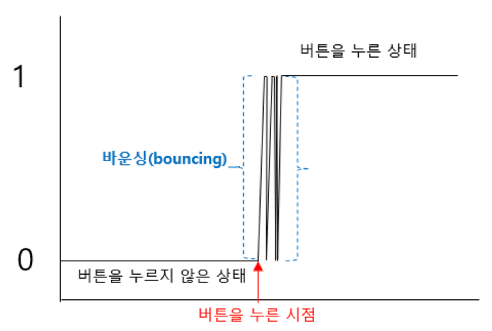
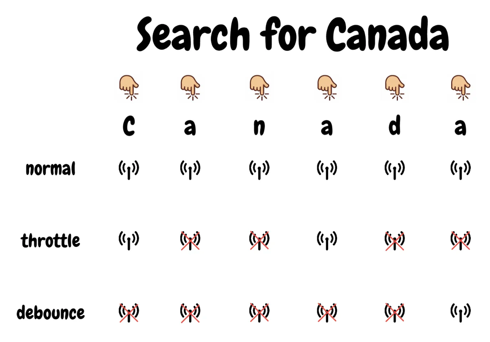

# 디바운싱(Debouncing)과 쓰로틀링(Throttling)

개념 먼저 살펴보자.

- **디바운싱**: 빈번하게 발생하는 이벤트를 **특정 시간 이후에 한 번만** 실행시키는 최적화 기법
- **쓰로틀링**: 빈번하게 발생하는 이벤트를 **일정한 간격으로 한 번만** 실행시키는 최적화 기법

여기서 말하는 '빈번하게 발생하는 이벤트'의 예로써 검색어를 입력하는 상황을 들 수 있다.
<br>'두더지'를 검색하려고 한다면 `'ㄷ', '두', '둗', '두더', '두덪', '두더지'` 의 과정을 거쳐,
<br>하나의 단어를 타이핑하기 위해 총 6번의 쿼리를 날리게 된다.
<br>유료 API를 사용하고 있다면 비용면에서 문제가 생길 수 있고, 당연히 성능에도 좋지 않은 영향을 끼칠 것이다.

이러한 문제에 대한 대표적인 해결 방법이 **디바운싱**과 **쓰로틀링**이다.

## 디바운싱(Debouncing)

회로를 구성할 때, 전압이 순간적으로 불규칙하게 들어가는 현상을 바운싱 현상이라고 한다.
<br>이 바운싱 현상이 발생하는 시간만큼의 딜레이를 주어 문제를 해결하는 방법인 **디바운싱**에서 유래되었다.



### 구현

서론에 언급한 검색어 입력 상황에 디바운싱을 적용해보자.
<br>사람들은 보통 검색어를 입력할 때 한번에 타이핑한다.
<br>따라서 input 이벤트가 발생할 때마다 타이머를 설정하고, 일정 시간동안 입력이 없으면 입력이 끝난 것으로 간주하면 된다.
<br>설정한 시간이 지나기 전에 입력이 발생하면, 그 전에 발생한 타이머는 취소하고 새로운 타이머를 재설정하도록 구현할 수 있다.

```javascript
const delay = 200;
let timer;

document.querySelector("#input").addEventListener("input", function (e) {
  clearTimeout(timer);
  timer = setTimeout(() => {
    console.log("디바운싱이지요", e.target.value);
  }, delay);
});
```

## 쓰로틀링(Throttling)

쓰로틀링은 엔진의 연료를 조절하는 데 사용되는 레버인 **Throttle**이라는 단어에서 유래되었다.
<br>위에서 언급했듯이, 실행 횟수에 제한을 거는 것이기 때문에 스크롤이 일어날 때 발생하는 이벤트 처리 등 성능 문제를 해결할 때 많이 사용한다.

### 구현

검색 기능에는 쓰로틀링보다 디바운싱이 더 적합해 보이지만,
<br>중간에 검색 결과를 보여주는 기능이 필요하다면 쓰로틀링도 활용할 수 있겠다.

이번엔 타이머가 설정되어 있으면 아무 동작도 하지 않고, 타이머가 없다면 타이머를 설정한다.
<br>타이머는 일정 시간 후에 스스로를 해제하고, 검색어를 처리하도록 구현하면 된다(console 부분).

```javascript
const delay = 200;
let timer;

document.querySelector("#input").addEventListener("input", function (e) {
  if (!timer) {
    timer = setTimeout(function () {
      timer = null;
      console.log("쓰로틀링이네요", e.target.value);
    }, delay);
  }
});
```

## 디바운싱 vs 쓰로틀링

### 디바운싱

특정 시간 동안 이벤트가 발생하지 않을 때 한 번만 실행된다.
<br>즉, 이전 이벤트를 무시하고 마지막 이벤트가 발생한 이후 일정 시간 동안 추가 이벤트가 발생하지 않아야 실행된다.

### 예시

검색창에서 API 호출을 줄일 때, resize 이벤트에서 레이아웃을 계산할 때 사용한다.
<br>검색창에 입력할 때, 디바운싱을 적용해 사용자가 입력을 멈춘 후에만 검색 요청을 보내는 식이다.

### 쓰로틀링

첫 이벤트가 발생한 이후 일정 간격마다 이벤트를 실행한다.
<br>즉, 이벤트가 지속적으로 발생하더라도 일정한 주기로 실행된다.

### 예시

무한 스크롤 구현 시 스크롤 이벤트 처리나, 화면 캡처를 주기적으로 수행해야 하는 경우 사용한다.
<br>스크롤 이벤트에 쓰로틀링을 적용하면, 사용자가 페이지를 스크롤할 때 설정한 간격마다 이벤트가 실행되어 브라우저 과부하를 막고 부드럽게 동작되도록 만들 수 있다.

## 마치며

각각의 동작을 이해하는 데 도움이 되는 사진을 첨부한다.



정리하면,
<br>디바운싱은 이벤트 발생이 끝난 후에 동작하는 것이 적합한 경우,
<br>쓰로틀링은 이벤트가 지속적으로 발생할 때 간격을 두고 실행하는 것이 적합한 경우 사용한다.

<br>

[참고]

- [디바운싱과 쓰로틀링 이해하기](https://url.kr/wxkxmo)
- [쓰로틀링과 디바운싱](https://www.zerocho.com/category/JavaScript/post/59a8e9cb15ac0000182794fa)

[이미지 출처]

- [바운싱 현상](https://thrillfighter.tistory.com/597)
- [디바운싱과 쓰로틀링 이해하기](https://url.kr/wxkxmo)
