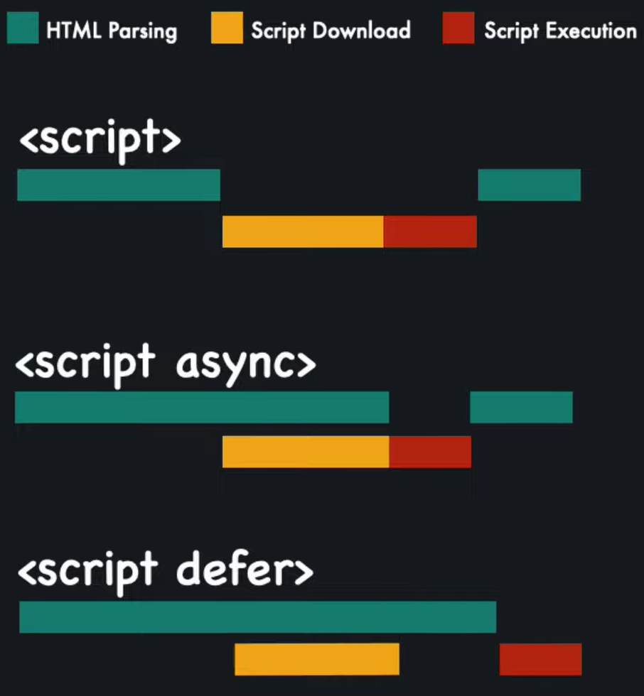

# defer vs async

웹 페이지에서 자바스크립트 파일을 로드할 때, 기본적으로 script 태그는 HTML 문서의 렌더링을 차단한다.
<br>이 때 defer와 async 속성을 사용하여 자바스크립트 파일이 HTML 렌더링을 차단하지 않도록 방지할 수 있다.

## `<script />`

```html
<body>
  <script src="example.js"></script>
</body>
```

위와 같이 속성 없이 script 태그를 사용하면, 자바스크립트 파일(`example.js`)이 로드될 때 페이지 렌더링이 차단된다.
<br>즉, 자바스크립트가 다운로드된 후 실행되기 전까지 브라우저는 HTML 문서를 렌더링하지 않으며, 파일 크기가 크면 페이지 로딩 속도를 저하시킬 수 있다.

## `<script defer />`

```html
<body>
  <script src="example.js" defer></script>
</body>
```

defer 속성은 자바스크립트 파일 다운로드 및 실행 시점을 HTML 문서 파싱 이후로 미룬다.
<br>이때 파일 다운로드와 실행은 DOMContentLoaded가 실행되기 전에 완료되며, 다운로드 순서는 파일 크기와 상관없이 코드가 작성된 순서대로 진행된다.

## `<script async />`

```html
<body>
  <script src="example.js" async></script>
</body>
```

async 속성은 자바스크립트 파일을 비동기적으로 다운로드하고, 다운로드가 완료되면 즉시 실행한다.
<br>defer와 다르게 순서를 보장하지 않으며, 다운로드가 완료된 순서대로 실행된다. DOMContentLoaded와도 무관하게 동작한다.
<br>광고와 같이 자바스크립트 파일 간에 의존 관계가 없을 때 유용하게 사용된다.

## defer vs async

| 속성    | 로드 순서                               | 특징                                                 |
| ------- | --------------------------------------- | ---------------------------------------------------- |
| -       | HTML 문서 파싱 중 다운로드, 실행        | HTML 파싱이 끝날 때까지 자바스크립트가 실행되지 않음 |
| `defer` | HTML 문서 파싱 후 다운로드, 실행        | HTML 문서가 모두 로드된 후 실행됨                    |
| `async` | 자바스크립트 파일 다운로드 후 즉시 실행 | 자바스크립트 파일이 다운로드되면 즉시 실행됨         |

## 정리

<br/>

- **defer**: HTML 문서의 로딩이 완료된 후 자바스크립트를 실행하는 방식. 실행 순서 보장됨.
- **async**: 자바스크립트 파일을 다운로드 완료 후 즉시 실행하는 방식. 실행 순서가 보장되지 않음.

<br/>

[참고]

- [Async vs Defer](https://www.youtube.com/shorts/3peCiMg332o)
- [script 태그는 어떻게 외부자원을 가져오나(async, defer)](https://youtu.be/c_IGI0JjtUA?si=6FE_DYaOin-6SVPc)
