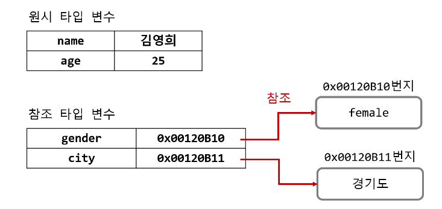
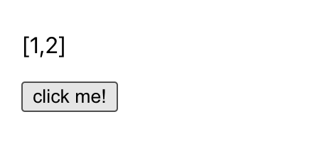

# 자바스크립트에서의 불변성(Immutability)

불변성(Immutability)은 말 그대로 변하지 않는 성질을 말한다.<br/>
JavaScript에서의 불변성은 **객체가 생성된 이후 변경할 수 없는 것**을 의미한다. (변경 !== 재할당)

불변성에 대해 알기 위해서 JavaScript의 type에 대해 알아두는 것이 좋다.
<br/> 타입 별로 데이터 저장 방식에 차이가 있기 때문이다.

- 원시 타입(Primitive)
  - `Number`, `null`, `undefined`, `String`, `Boolean`, `Symbol`, `BigInt`
- 참조 타입(Reference)
  - `Object`, `Array`, `Function`

 <br/>

**_"원시 타입은 Immutable 하고 참조 타입은 mutable 하다."_**



원시 타입의 경우 콜스택에 바로 담기게 되고, 참조 타입은 메모리 힙 영역에 실제 값이 담기고 콜스택에는 메모리 힙의 주소값이 담기게 된다.


원시 타입을 재할당 하면 콜스택에는 새로운 값이 담긴다.
하지만 참조 타입의 값을 수정하면 콜스택에 담긴 주소는 바뀌지 않고 메모리 힙에 저장된 값이 변한다.

"변한다"의 기준이 되는 공간은 메모리 힙을 말한다. <br/>
콜스택의 값만 바뀌는 원시 타입은 immutable 하고, 메모리 힙의 값이 바뀌는 참조 타입은 mutable 하다는 것이다.

참조를 통해 값을 공유하고 있다면 그 상태가 언제든지 변경될 수 있기 때문에 의도하지 않은 동작이 수행될 수 있다.

### 불변성을 지켜야 하는 이유 (feat. React)

React의 예제를 살펴보면 불변성을 지켜야 하는 이유가 와닿는다.

```js
function App() {
  const [count, setCount] = React.useState(0);

  const handleClick = () => {
    setCount(count + 1);
  };
  return (
    <div style={{ padding: "20px" }}>
      <p>{count}</p>
      <button onClick={handleClick}>click me!</button>
    </div>
  );
}
```

React의 `setState` 는 콜스택에 있는 값을 비교한 뒤, 이전 값과 다르면 새로운 값으로 상태를 저장한다. Number 타입의 count는 버튼을 클릭할 때마다 숫자가 증가하는 것을 확인할 수 있다.

그러나 참조 타입인 배열의 경우를 보자.

```js
function App() {
  const [arr, setArr] = React.useState([1, 2]);

  const handleClick = () => {
    arr.push(3);
    setArr(arr);
  };

  return (
    <div style={{ padding: "20px" }}>
      <p>{JSON.stringify(arr)}</p>
      <button onClick={handleClick}>click me!</button>
    </div>
  );
}
```

버튼을 아무리 클릭해도 `setState`가 arr 값의 변경을 감지하지 못하고 [1, 2]만 출력된다.


이를 해결하기 위해서는 새로운 객체나 배열을 생성해서 `setState`에 넣어줘야 한다.
<br/> 즉, 콜스택에 저장되는 주소값을 바꿔줘야 한다는 것이다. 메모리 힙의 값이 바뀌어서는 안된다.

## 불변성을 지키는 방법

### 1. 배열을 리턴하는 메서드 활용

가장 간단한 방법은 새로운 배열을 생성하는 메서드들을 적극 활용하는 것이다.

- `map`, `filter`, `slice`, `reduce`
- `splice`, `push`는 원본 배열을 수정하므로 유의해야 한다.

### 2. Spread 연산자

새로운 배열이나 객체는 Spread 연산자를 활용하여 간편하게 생성할 수 있다.

```js

let newArr = [...arr, 3];
let newObj = { ...obj };

```

### 3. Object.assign

```js

Object.assign(target, ...sources);

```

타깃 객체로 소스 객체의 프로퍼티를 복사하게 된다. Object.assign을 사용해서 객체를 손쉽게 복사할 수 있다.

```js
let mole = {
  name: "yubin",
  age: 4,
};

let clone = Object.assign({}, mole);
```

### 4. JSON.parse(JSON.stringfy(obj))

앞서 말한 Spread 연산자, Object.assign 모두 객체 내부의 객체는 복사되지 않는다는 한계가 있다. (얕은 복사)
<br/> 객체의 깊은 복사가 필요한 경우에는 JSON.parse(JSON.stringfy(obj))를 사용한다.

```js
let mole = {

  name: "yubin",
  address: {
    city: "seoul",
  },
};

let clone = JSON.parse(JSON.stringfy(mole));
```

객체를 문자열로 변환한 뒤 다시 파싱해 다시 자바스크립트 객체로 만들어준다.
<br/>
간단한 방법이지만, 객체 내의 함수를 처리하지는 못한다. 간단한 객체만 복사가 가능하다.

### 5. 외부 라이브러리

Immer, Immutable.js, lodash와 같이 깊은 복사를 구현해주는 라이브러리들이 많다.

아래는 lodash에 포함 되어있는 `clonedeep` 함수의 사용 예제이다.

```js
const deepCopy = require("lodash.clonedeep");

let obj = { a: 1, b: { c: 2 } };
let clone = deepCopy(obj);
```

다만, 외부 라이브러리들은 설치해야 한다는 단점이 있다.

### 6. structuredClone

최근, 자바스크립트에서도 객체의 깊은 복사를 위한 내장함수를 제공하기 시작했다.<br/> 이 기능은 모든 브라우저에서 지원되며, 사용법도 간단하다.

```js
let obj = { a: 1, b: { c: 2 } };
let clone = structuredClone(obj);
```

이제 깊은 복사를 위해 더이상 외부 라이브러리에 의존할 필요가 없다.

<br/>

[참고]

- [[10분 테코톡] 라잇의 불변성](https://www.youtube.com/watch?v=LRlooA5sYhU)
- [[JavaScript] 객체의 불변성을 지키는 방법](https://jihyundev.tistory.com/20)


[이미지 출처]

- [JavaScript의 객체 타입](https://zion830.tistory.com/20)

