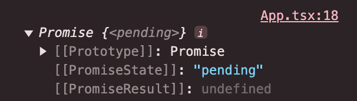
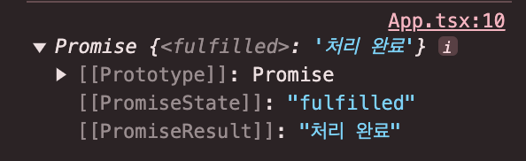
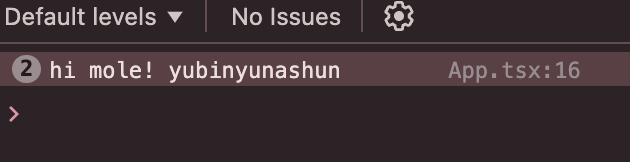

# Promise

JavaScript는 싱글 스레드 기반의 언어로, 한 번에 하나의 작업만 처리할 수 있다.<br/>
여러 작업을 동시에 처리하기 위해 비동기 처리 방식이 필요하다.

[비동기 처리](https://github.com/Study-Mole/study-cs-mole/blob/main/JavaScript/asyncronous_processing.md#callback-%ED%95%A8%EC%88%98)는 콜백 함수, Promise, [async/await]() 등의 다양한 방식으로 구현할 수 있다.

이번 시간에는 Promise에 대해 알아보자.

## Promise 객체

Promise는 비동기 작업의 최종 성공 또는 실패를 나타내는 객체이다.
<br/> 이를 통해 비동기 작업의 결과를 쉽게 관리할 수 있다.

다만 비동기 작업이 끝날 때까지 결과를 기다리는 것이 아니라, 미래의 어떤 시점에 결과를 제공하겠다는 '약속'을 반환한다는 의미에서 Promise라 명명 되었다.

### 객체 생성

new 키워드와 Promise 생성자 함수를 사용하여 생성한다. 두 개의 매개변수를 가진 콜백함수를 넣게 되는데, 첫 번째는 성공했을 때(resolve) 성공을 알리는 객체이며, 두 번째는 실패했을 때(reject) 실패임을 알리는 오류 객체이다.

```javascript
const promise = new Promise((resolve, reject) => {
  // 비동기 작업 수행
  const data = fetch("데이터 요청 url");

  if (data) resolve(data); // 데이터가 있는 경우 resolve 메서드 호출
  else reject("Error"); // 실패하여 데이터가 없는 경우 reject 메서드 호출
});
```

<br/>

## Promise 3가지 상태

Promise 객체는 다음 중 하나의 상태를 가진다.

- **Pending (대기)** : 이행하지도, 거부하지도 않은 초기 상태
- **Fulfilled (이행)** : 작업이 성공적으로 완료됨
- **Rejected (거부)** : 작업이 실패함

### 1. Pending

비동기 처리 로직이 완료되지 않은 상태이다. 프로미스 객체를 생성하고, 생성한 프로미스 객체를 출력하면 'pending'이 출력된다.

```javascript
const promise = new Promise((resolve, _) => {
  setTimeout(() => {
    resolve("처리 완료");
  }, 5000);
});

console.log(promise);
```



### 2. Fulfilled

위의 코드를 실행한 뒤 5초가 지나면, 아래와 같이 fulfilled 상태로 바뀐다.<br/>이행 상태란 비동기 로직이 성공적으로 완료되었다는 것을 표현하기 위한 상태라고 보면 된다.



그리고 fulfilled 상태로 변한 Promise 객체는 체이닝 된 `.then()` 메서드를 호출하여 처리 결과 값을 받을 수 있다.

### 3. Rejected

fulfilled와 반대로 reject()를 호출하면 Promise 객체가 rejected 상태가 된다. 역시 rejected 상태가 된 Promise 객체는 체이닝된 `.catch()` 메서드를 호출한다.

```javascript
const promise = new Promise((_, reject) => {
  setTimeout(() => {
    reject("처리 실패");
  }, 5000);
});
```

## Promise 핸들러

비동기 작업의 결과에 따라 `.then()`, `.catch()` 메서드 체이닝을 통해 성공과 실패에 대한 후처리를 진행할 수 있다.

위의 `resolve(data)`를 호출하게 되면 `.then()`으로 이어져 then 메서드에서 추가 처리를 진행한다. 매개변수인 data는 then 메서드의 콜백 함수 인자로 들어가 사용할 수 있게 된다.

반대로 처리에 실패하여 `reject('Error')`가 호츌되면 `.catch()`로 이어져 실패에 대한 추가 처리를 진행한다.

```javascript
promise
  .then((data) => {
    // resolve() 호출 시
    console.log("data: ", data);
  })
  .catch((error) => {
    // reject() 호출 시
    console.log(error);
  })
  .finally(() => console.log("always")); // 무조건 실행되는 코드
```

### Promise Chaining

프로미스 체이닝이란, 프로미스 핸들러를 연달아 연결하는 것을 뜻한다. 프로미스 체이닝으로 비동기 작업을 순차적으로 수행할 수 있다.

예를 들어 아래의 코드에서는 molePromise라는 프로미스를 생성하고 `.then()`메서드를 통해 핸들러를 연결하는 과정을 보여준다. 각 핸들러는 이전 프로미스의 값에 두더지들의 이름을 붙인 값을 반환한다.

```javascript
const molePromise = new Promise((resolve, _) => {
  resolve("hi mole! ");
});

molePromise
  .then((str) => str + "yubin")
  .then((str) => str + "yuna")
  .then((str) => str + "shun")
  .then((str) => console.log(str));
```



체이닝이 가능한 이유는 then이 리턴하는 값이 프로미스 객체로 감싸져 반환되기 때문이다. <br/> 그 다음 핸들러에서 반환된 프로미스 객체를 받아 처리한다.
<br/>

### Promise의 이점

Promise를 사용하면 다음과 같은 이점이 있다.

- 핸들러로 비동기 처리 시점을 명확하게 표현, 연속된 비동기 처리 작업을 작성하기 쉬움
- 3가지의 상태값을 통해 비동기 작업 상태를 쉽게 확인
- 코드의 유지 보수성 증가

Promise는 비동기 처리를 할때 사용하던 콜백 함수의 콜백 지옥을 방지하기 위해, async/await은 Promise의 후속 처리 메서드를 사용하지 않고도 동기 처리처럼 프로미스가 처리 결과를 반환할 수 있도록 하기 위해 등장한 개념이다.

다음 시간에는 Promise를 기반으로 동작하는 async/await에 대해 알아보자!

<br/>

[참고]

- [Promise - JavaScript - MDN Web Docs](https://developer.mozilla.org/ko/docs/Web/JavaScript/Reference/Global_Objects/Promise)
- [자바스크립트 Promise 쉽게 이해하기](https://joshua1988.github.io/web-development/javascript/promise-for-beginners/)
- [자바스크립트 Promise 개념 & 문법 정복하기](https://inpa.tistory.com/entry/JS-%F0%9F%93%9A-%EB%B9%84%EB%8F%99%EA%B8%B0%EC%B2%98%EB%A6%AC-Promise)
