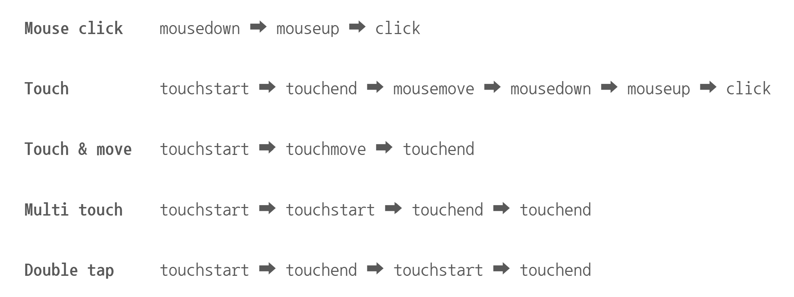

## touch vs click

데스크톱 환경에서 제대로 동작하던 기능이 모바일 환경에서 잘 동작하지 않을 때 의심해볼 수 있는 다양한 원인 중 하나는 `touch`와 `click` 이벤트 간의 충돌이다.
두 이벤트의 발생 과정을 살펴보고, 이를 활용한 트러블 슈팅 방법에는 어떤 것이 있는지 알아보자.

### 공통점과 차이점

터치와 클릭은 화면 상의 요소를 누르고, 이동이 필요하면 움직인 뒤, 떼는 동작을 수행하는 공통적인 시퀀스를 갖는다.
각 구분 동작에 대한 이벤트 타입은 아래와 같다.

- `click`: `mousedown`, `mousemove`, `mouseup`, `click`
- `touch`: `touchstart`, `touchmove`, `touchend`

동일한 동작의 시퀀스를 갖는다는 점을 이용하여,
<br>아래 코드를 통해 모바일 기기인 경우 마우스 이벤트 대신 터치 이벤트를 사용하도록 이벤트 타입을 변환시킬 수 있다.

```javascript
function getConvertedEventType(type) {
  if (isMobile()) {
    if (type === "mousedown") {
      type = "touchstart";
    } else if (type === "click") {
      type = "touchend";
    }
  }

  return type;
}
```

두 이벤트는 얼핏 같은 동작의 시퀀스를 갖는 것처럼 보일 수 있지만, 몇 가지 차이점을 갖는다.

- 마우스는 화면 위에 항상 떠 있고, 터치는 그렇지 않다. 만약 두 개의 점과 클릭(터치)하려고 한다면, 마우스는 첫 번째 점 위로 이동하여 클릭한 뒤 다음 점으로 마우스를 옮겨(`mousemove`) 클릭해야 한다. 하지만 터치는 두 손가락으로 두 점을 동시에 누르거나 한 손가락으로 점을 터치한 뒤 손가락을 움직여 어느 손가락이든 두 번째 점을 터치하면 그만이다. 이 때 화면은 두 번의 터치를 이어주는 동작을 알 수 없다.
- 방금 언급한 것처럼, 터치는 2개 이상의 포인터로 화면과 상호작용할 수 있지만, 마우스는 단 하나의 포인터만을 사용할 수 있다. 이를 보완하기 위해 우클릭, 휠이나 키보드와의 조합을 이용해 다양한 동작을 수행할 수 있으나 터치는 이와 반대로 누르고 이동한 뒤 떼는 동작만으로 모든 동작을 수행해야 한다. 마우스를 누르고 이동한 뒤 떼면 드래그 앤 드랍이 되지만, 터치로 누르고 이동한 뒤 떼면 스크롤이 된다.

이렇게 두 이벤트의 공통점과 차이점을 고려하지 않으면 의도하지 않은 동작이 이뤄져 사용성을 크게 해칠 수 있다.

<br>이번에는 아래 코드를 통해 브라우저에서 터치와 클릭을 어떻게 받아들이는지 알아보자.

```javascript
function createParagraph(text) {
  const el = document.createElement("p");
  el.innerText = text;

  return el;
}

const printEl = document.getElementById("print");

[
  "touchstart",
  "touchmove",
  "touchend",
  "mousedown",
  "mousemove",
  "mouseup",
  "click",
].forEach((eventType) => {
  document.addEventListener(eventType, () => {
    printEl.appendChild(createParagraph(eventType));

    window.scrollTo(0, document.body.scrollHeight);
  });
});
```

`<div id="print"></div>`의 HTML 코드에 위 코드를 실행하여
<br>데스크탑과 모바일 환경에서 각각 클릭과 터치를 실행해 본 결과를 정리하면 아래 사진과 같다.
<br>브라우저마다 차이가 있을 수 있으나, 일반적인 이벤트 발생 순서라고 보면 된다.



발생 순서도 의외이고, 또 터치 동작을 수행할 때만 `click` 이벤트와 각종 마우스 이벤트가 발생한다는 점도 특이허다.
<br>터치를 해도 마우스 이벤트가 발생한다는 것은, 처음에 소개한 이벤트 타입 변환 함수 없이도 원하는 동작을 수행할 수 있는 것처럼 보이지만, 굳이 이 함수를 사용하는 데에는 `touchstart` 이벤트와 `click` 이벤트 사이에 생기는 `300ms` 정도의 딜레이 때문이다.

사용자가 즉각적이라고 느끼는 최대 지연 시간은 `100ms`인데, `300ms` 정도의 큰 딜레이를 넣은 데에는 더블 탭, 확대, 축소 등 터치 동작에서의 다양한 제스처를 지원하려는 목적이 있다.
<br>딜레이가 없다고 가정하고, 그런 경우는 본 적이 없긴 하지만 예를 들어 버튼 요소를 확대 하려는 상황을 생각해보자. 확대를 시도해보기도 전에 바로 버튼이 눌려서, 우리는 영원히 그 동작을 수행할 수 없을 것이다.

하지만 이 딜레이 때문에 문제가 생길 수도 있다.
<br>버튼 요소 머리맡에 `DatePicker`가 있고, 달력이 펼쳐진 상태에는 아래 버튼이 덮인다고 가정하자.
<br>열려있는 `DatePicker`에서 날짜를 터치하면 `DatePicker`가 닫힐 것이고, 우리가 클릭을 의도했던 드롭다운 요소는 닫히고 없으므로 약 `300ms`가 흐른 후 그 아래 있던 버튼이 클릭 되는 것이다.

### 해결 방법

**1. 모바일 최적화를 통한 딜레이 감소**

뷰포트의 너비를 기기 화면의 너비와 동일하게 맞춰줌으로써 모바일 최적화를 이룰 수 있는데, 2014년 크롬 32 버전부터는 모바일 페이지에 최적화된 사이트의 경우 딜레이를 만들지 않도록 동작한다.

```HTML
<meta name="viewport" content="width=device-width" />
```

뷰포트의 너비를 지정해줌으로써 딜레이가 `60ms` 정도로 줄어드는 것을 확인할 수 있다.

<br>

**2. 스타일 적용을 통한 딜레이 제거**

```css
* {
  touch-action: manipulation;
}
```

`css`에서 위 스타일을 적용하여 딜레이를 제거하는 방법도 있다.
<br>이 속성은 터치 기반 장치에서 사용자 인터페이스 반응 속도를 개선해준다.

<br>

**3. `preventDefault()`로 모든 마우스 이벤트 제거**

페이지 전체가 아닌 내부 요소에는 위 방법이 적합하지 않다.
<br>처음에 제시한 이벤트 타입 변환 함수를 사용하면 여전히 터치가 일어날 때 클릭도 함께 일어난다.
<br>이 때 `touchstart`나 `touchend`에서 `preventDefault()`를 호출해보자.

```javascript
function createParagraph(text) {
  const el = document.createElement("p");
  el.innerText = text;

  return el;
}

const printEl = document.getElementById("print");

document.addEventListener("click", () => {
  printEl.appendChild(createParagraph("click"));
});

document.addEventListener("touchend", (ev) => {
  ev.preventDefault();
  printEl.appendChild(createParagraph("touch"));
});
```

이렇게 하면 내부에서 마우스 이벤트의 발생을 막을 수 있고, 전과 달리 터치 시에 `touch` 이벤트만 발생한다.
이 때 `touchstart`가 아닌 `touchend`에 `preventDefault()`를 사용한 이유는 `addEventListener`의 세 번째 인자의 옵션 중 하나인 `passive` 옵션이 `false`를 기본값으로 가지지만 크롬과 파이어폭스 등 일부 브라우저에서 스크롤 성능 향상을 위해 `touchstart`와 `touchmove` 이벤트에 대해 기본값을 `true`로 설정하기 때문이다. 이 경우 콜백 함수 내부에서 `preventDefault()`를 호출해도 콘솔 경고만 출력할 뿐 `preventDefault()`가 제대로 동작하지 않게 된다.

<br>

**4. 모바일 기기 인식하기**

클릭이 필요한 상황이 있다. 그럴 땐 기기를 인식하여 원하지 않는 이벤트를 제거하는 방식으로 해결하면 된다.
<br>모바일 기기임을 인식하는 여러 방법을 살펴보자.

```javascript
const isMobile = ('ontouchstart' in window)||
	(navigator.maxTouchPoints > 0)||
	(navigator.msMaxTouchPoints > 0));
```

`touch`가 발생하면 모바일 기기라고 판단하는 함수이지만, 요즘 세상이 원체 좋아져서 터치가 되는 노트북이 있다. 그런 경우엔 적합하지 않을 것이다.

```javascript
const checkIsMobile = () => {
  const mobileRegex = [
    /Android/i,
    /iPhone/i,
    /iPad/i,
    /iPod/i,
    /BlackBerry/i,
    /Windows Phone/i,
  ];

  const agent = window.navigator.userAgent;
  const isMobile = mobileRegex.some((regex) => agent.match(regex));

  return isMobile;
};
```

HTTP 요청을 보내는 디바이스와 브라우저 등의 식별 정보를 담고 있는 header의 한 종류인 `window.navigator.userAgent`를 활용한 코드이다.
<br>하지만 Next.js 같은 프레임워크를 이용하여 SSR을 개발할 때는 `window` 객체를 사용하지 못하기 때문에 `window.navigator.userAgent`에 접근할 수가 없다.

```javascript
import { useEffect, useState } from "react";

const useMobile = () => {
  const [isMobile, setIsMobile] = useState(false);

  useEffect(() => {
    const mobileRegex = [
      /Android/i,
      /iPhone/i,
      /iPad/i,
      /iPod/i,
      /BlackBerry/i,
      /Windows Phone/i,
    ];

    const agent = window.navigator.userAgent;
    setIsMobile(mobileRegex.some((regex) => agent.match(regex)));
  }, []);

  return isMobile;
};

export default useMobile;
```

위와 같은 커스텀 훅을 사용하여 해결할 수 있다.

[참고]

- [마우스 이벤트, 제대로 사용하고 계신가요? - 클릭과 터치](https://east-star.tistory.com/44)
- [터치와 클릭, 우리 깐부잖아](https://ui.toast.com/posts/ko_20220106)

<br>
