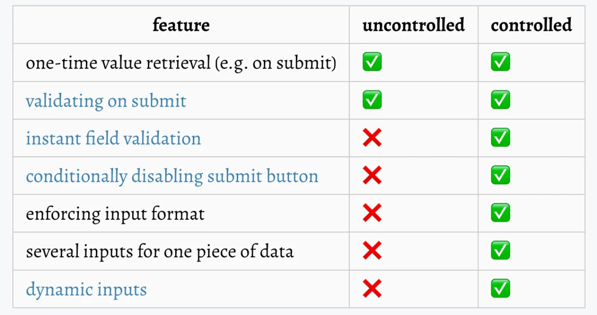

# React > Library

- [React Hook Form](#React-Hook-Form)

---

## React Hook Form

웹 프론트엔드를 개발할 때 데이터를 다루는 방법은 여러 가지가 있다.

(ex: 차트를 통한 데이터 시각화, 폼을 통한 데이터 수집, 테이블을 통한 데이터 나열 등)

React Hook Form은 Form을 다루는 라이브러리로, 일반적인 제어 컴포넌트 폼을 비제어 컴포넌트 방식으로 관리하고 개발할 수 있게 해준다.

**그럼 여기서 제어 컴포넌트와 비제어 컴포넌트는 무엇일까?**

---

### 제어 컴포넌트

"제어 컴포넌트"는 React에서 폼 입력 값이 React의 상태(state)에 의해 관리되는 입력 요소를 의미한다.

예를 들어, 사용자가 폼에 뭔가를 입력할 때 그 값이 React 컴포넌트의 상태에 저장되고, 이 상태가 입력 요소의 값으로 반영되는 방식이다.

즉, 폼에 사용자가 입력하는 내용이 React 컴포넌트가 관리하는 상태로 들어가고, 컴포넌트는 이 상태를 이용해 화면을 다시 그려준다.

정리하자면 제어 컴포넌트란 React에 의해 값이 제어되는 입력 폼 엘리먼트를 뜻한다.

### 예시

리액트에서 input 값을 받아올 때 일반적으로 state를 만들고 다음과 같이 사용한다.

```javaScript
const [value, setValue] = useState("");
const [password, setPassword] = useState("");
const [email, setEmail] = useState("");

<input
  type="text"
  value={value}
  onChange={(e) => setValue(e.target.value)}
/>
<input
  type="password"
  value={password}
  onChange={(e) => setPassword(e.target.value)}
/>
<input
  type="email"
  value={email}
  onChange={(e) => setEmail(e.target.value)}
/>
```

제어 컴포넌트는 실시간으로 값이 동기화되는 특징이 있다.

리액트는 state 값이 변경될 때마다 리렌더링되므로, 입력 폼이 늘어나면 관리해야 하는 state도 많아지고, 입력할 때마다 컴포넌트가 리렌더링되어 불필요한 연산이 발생할 수 있다.

또한 유효성 검사가 필요한 경우 에러 상태를 관리할 state와 검증 함수가 추가되므로 코드가 길어지고 유지보수가 어려워진다.

### 비제어 컴포넌트

비제어 컴포넌트는 React에 의해 값이 제어되지 않는 컴포넌트를 뜻한다.

비제어 컴포넌트에서는 폼의 입력 값이 React의 상태와 실시간으로 연결되지 않으며, 사용자가 입력한 값이 submit 시점에만 한 번에 가져와진다. 이때 **ref**를 사용해 필요한 순간에만 값에 접근할 수 있다.

비제어 컴포넌트 방식에서는 입력 값이 변경되어도 리렌더링이 발생하지 않으므로, 폼이 많아도 state를 추가하지 않고 리렌더링도 최소화할 수 있다. 불필요한 리렌더링을 막는 것은 리액트의 성능 개선에 필수적인 요소이다.

### 제어 컴포넌트 vs 비제어 컴포넌트



### React Hook Form을 쓰는 이유?

1. React Hook Form은 기본적으로 비제어 컴포넌트 방식으로 구현되어, 리렌더링 문제를 해결하면서도 Form 데이터를 효율적으로 관리할 수 있다.

2. 비제어 컴포넌트 방식이지만 데이터가 동기화되어, 데이터를 한 곳에서 관리하는 것이 가능하다.

3. 일관성 있는 코드 작성이 가능하다.

정리하자면, **React Hook Form은 비제어 컴포넌트의 장점은 그대로 살리면서도 실시간 유효성 검사, 실시간 동기화 등의 기능을 제공해 유효성 검사 및 데이터 동기화가 필요한 Form을 효과적으로 관리할 수 있게 한다.**

---

### React Hook Form 사용법

### useForm

useForm의 핵심 골자는 다음과 같다.

1. Form을 구현할 컴포넌트에서 useForm을 호출한다.
2. 호출 시 폼 설정값을 인자로 전달한다.
3. useForm이 반환하는 값들을 활용해 Form을 구현한다.

**useForm은 객체 하나를 반환하며, 주로 Controller와 Register 함수가 많이 사용된다.**

---

### Controller 함수

React Hook Form의 Controller 함수는 주로 외부 라이브러리와 통합할 때 유용하다.

```Javascript
import { useForm, Controller } from 'react-hook-form';

const MyForm = () => {
  const { control, handleSubmit } = useForm();

  const onSubmit = (data) => {
    // 폼 제출 처리...
  };

  return (
    <form onSubmit={handleSubmit(onSubmit)}>
      <Controller
        name="username"
        control={control}
        render={({ field }) => <input {...field} />}
      />
    </form>
  );
};
```

### rules

rules는 입력 필드의 검증 규칙을 정의할 때 사용하며, Controller에서 입력 필드의 유효성 검사를 설정하는 데 중요한 역할을 한다.

### 예시

required: 필수 항목으로 설정
<br/>minLength / maxLength: 최소 및 최대 입력 길이 설정

```Javascript
rules={{ required: "This field is required" }}

rules={{
  minLength: { value: 3, message: "At least 3 characters required" },
  maxLength: { value: 10, message: "Up to 10 characters allowed" }
}}
```

---

### Register 함수

Register는 직접적으로 폼 요소를 등록할 때 사용된다.

```Javascript
import { useForm } from 'react-hook-form';

const MyForm = () => {
  const { register, handleSubmit } = useForm();

  const onSubmit = (data) => {
    // 폼 제출 처리...
  };

  return (
    <form onSubmit={handleSubmit(onSubmit)}>
      <input {...register('username')} />
    </form>
  );
};
```

Register로 유효성 검사를 설정할 수 있으며, 두 가지 타입의 인자를 받는다.

```Javascript
// validation 규칙만 전달
{ maxLength: 2 }

// validation 규칙과 에러 메시지 함께 전달
{ maxLength: { value: 2, message: '땡 틀렸습니다' }}
```

---

### field 속성

field에는 react-hook-form이 폼을 관리하기 위해 설정해 놓은 몇 가지 중요한 속성이 포함되어 있다.

- field.value: 사용자가 입력한 값
- field.onChange: 입력 시 호출되는 함수
- field.onBlur: 포커스가 빠져나갈 때 호출되는 함수
- field.name: 필드의 이름, Controller에서 지정한 name값

---

### formState

formState는 Form의 다양한 상태를 담고 있으며, 자주 사용되는 프로퍼티는 다음과 같다.

- isDirty: 입력값의 수정 여부
- isValid: 모든 필드에 에러가 없을 경우 true
- errors: validation 에러 발생 시 에러가 발생한 필드를 확인

```Javascript
const { handleSubmit, formState: { isDirty, isValid, errors }} = useForm({ mode: "onChange" });
```

### 주의점

**formState의 프로퍼티들은 구조 분해 할당 방식으로 사용해야 최신 값을 반환한다. formState는 프록시 객체로 구현되어 있어, 구조 분해 방식이 아닌 .프로퍼티로 접근하면 최신 상태가 반영되지 않는다.**

```JavaScript
// ❌ formState.isValid is accessed conditionally,
// so the Proxy does not subscribe to changes of that state
return <button disabled={!formState.isDirty || !formState.isValid} />;

// ✅ read all formState values to subscribe to changes
const { isDirty, isValid } = formState;
return <button disabled={!isDirty || !isValid} />;
```

---

### watch

watch는 입력값을 다른 곳에 표시해야 할 때 사용하며, watch('name') 호출 시 'name' 필드의 최신 값을 반환한다.

### clearErrors

에러가 표시된 후 입력창에 포커스가 되면 에러를 없애고 싶을 때 사용한다. 특정 필드 이름을 넘기거나 모든 에러를 없앨 수 있다.

### 인자

useForm에는 다양한 설정값을 담은 객체를 넘길 수 있으며, 필수값은 아니므로 생략 가능하다. mode와 defaultValues를 살펴볼 만하다.

- mode: validation 실행 시점을 설정 (onSubmit 기본, onChange, onBlur 등)
- defaultValues: 폼의 기본값을 설정

### 예시

```Javascript
// Mode
const { handleSubmit, formState: { errors } } = useForm({ mode: "onChange" });

// Default Values
const { handleSubmit, reset, formState: { isDirty } } = useForm({
  defaultValues: {
    username: "john_doe",
    email: "john@example.com",
  },
});
```

---

### **Controller vs Register**

- 편의성:
  - `Controller`는 외부 라이브러리와의 연동이 간편하며, 컴포넌트 간의 상태를 쉽게 전달할 수 있다.
  - `Register`는 직접적인 등록으로 렌더링 효율이 높다.
- 유연성:
  - `Controller`는 외부 라이브러리와의 통합에 유리하나, 사용자 정의 요소에 적용하기 어렵다.
  - `Register`는 직접적인 등록으로 자유도가 높으며, 사용자 정의 요소에 적용 가능하다.
- 성능:
  - 큰 규모의 폼이나 동적인 상황에서 `Controller`는 렌더링 성능에 유리할 수 있다.
  - 작은 규모의 폼에서는 `Register`가 직접적으로 등록되어 렌더링 성능이 우수할 수 있다.
