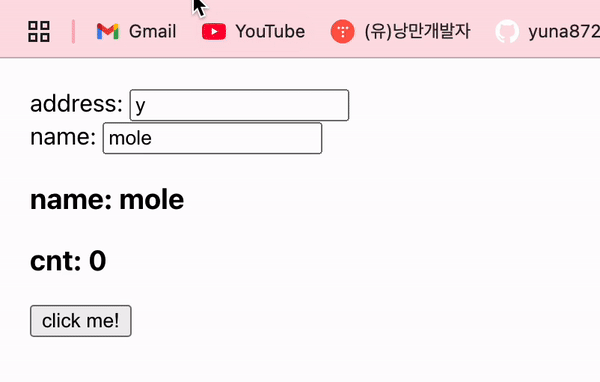

# React Memoization

## `memo`

React는 부모 컴포넌트가 렌더링될 때 자식 컴포넌트도 렌더링되도록 설계되어있다.<br/>

memo는 컴포넌트를 memoize하는 API이다. memo를 사용하면 **컴포넌트의 props가 변경되지 않는 한 리렌더링을 하지 않는다.**

### 레퍼런스

memo의 동작 방식은 꽤 간단하다.<br/>
리렌더링을 방지하고자 하는 컴포넌트의 이전 props와 새로운 props를 받아 두 값이 다른 경우에만 리렌더링한다.

```javascript
import { memo } from "react";

const MemoizedComponent = memo(Component, arePropsEquals);
```

- `Component`
  - memoize하려는 컴포넌트이다.
  - 원본을 수정하지는 않고 memoized된 새로운 컴포넌트를 반환한다.
- `arePropsEquals` (optional)
  - 컴포넌트의 이전 props와 새로운 props 두 가지를 받는 함수이다.
  - 두 props가 같다면 `true`, 그렇지 않으면 `false`를 반환한다.
  - 일반적으로 이 함수를 개발자가 직접 지정하지는 않는다.

`memo`는 두 매개변수를 가지고 새로운 React 컴포넌트를 반환하게 된다.

## 사용 방법

아래의 코드를 보자.<br/> Greeting의 props인 name이 변경되지 않는 한 이 컴포넌트는 리렌더링 되지 않는다.

```javascript
const Greeting = memo(function Greeting({ name }) {
  return <h1>Hello, {name}!</h1>;
});

export default Greeting;
```

export 할 때 memo로 감싸주어도 위 코드와 동일하게 동작한다.

```javascript
const Greeting = function Greeting({ name }) {
  return <h1>Hello, {name}!</h1>;
};

export default memo(Greeting);
```

### Memoization된 컴포넌트 업데이트하기

메모화된 컴포넌트를 업데이트하기 위해서는 state나 context를 활용하면 된다.<br/>

아래의 예시를 보자.<br/>
App이라는 컴포넌트는 메모화된 Greeting 컴포넌트를 포함하고 있으며 props로는 name을 전달한다.<br/>
address, name는 App 컴포넌트에서 사용하는 state이다.

```javascript
import React, { useState } from "react";
import "./App.css";
import Greeting from "./components/Greeting";

function App() {
  const [name, setName] = useState("mole");
  const [animal, setAnimal] = useState("yongin");
  const onChangeName = (e: any) => {
    setName(e.target.value);
  };

  const onChangeAnimal = (e: any) => {
    setAnimal(e.target.value);
  };

  return (
    <div style={{ padding: "20px" }}>
      <div>
        <span>address: </span>
        <input type="text" value={animal} onChange={onChangeAnimal} />
      </div>
      <div>
        <span>name: </span>
        <input type="text" value={name} onChange={onChangeName} />
      </div>
      <Greeting name={name} />
    </div>
  );
}

export default App;
```

Greeting 컴포넌트에 cnt라는 state를 만들어두고 버튼을 클릭할때마다 증가하도록 했다.

```javascript
const Greeting = memo({ name }: Props) => {
  const [cnt, setCnt] = useState(0);
  return (
    <div>
      <h3>name: {name}</h3>
      <h3>cnt: {cnt}</h3>
      <button onClick={() => setCnt((prev) => prev + 1)}>click me!</button>
    </div>
  );
};

```

아래의 결과에서 리렌더링은 컴포넌트 테두리의 깜빡임으로 확인할 수 있다.
<br/>아무리 메모화된 컴포넌트라 하더라도 props가 아닌 state나 context가 변경되는 경우에는 리렌더링된다.

- 메모화된 Greeting 컴포넌트는 name이라는 props에 변경이 있어야만 리렌더링 된다.
- address가 바뀌더라도 Greeting은 리렌더링되지 않는다.
- Greeting 컴포넌트 내부의 state인 cnt가 변화하면 메모화된 컴포넌트이더라도 리렌더링된다.



### props 변경 최소화하기

React는 [`Object.is`](https://developer.mozilla.org/ko/docs/Web/JavaScript/Reference/Global_Objects/Object/is)를 사용하여 props를 비교한다.<br/>
`Object.is(3, 3)`은 `true`이지만 `Object.is({}, {})`는 `false`이다.

`memo`를 최대한 활용하려면, props가 변경되는 것을 최소화하는 것이 좋다.<br/>
예를 들면 props가 객체인 경우 useMemo를 사용하여 컴포넌트가 매번 객체를 다시 만드는 것을 방지한다.

```javascript
function Page() {
  const [name, setName] = useState('Taylor');
  const [age, setAge] = useState(42);

  const person = useMemo(
    () => ({ name, age }),
    [name, age]
  );

  return <Profile person={person} />;
}

const Profile = memo(function Profile({ person }) {...});
```

props의 변경을 최소화하는 더 좋은 방법은 props를 개별로 받는 것이다.

```javascript
return <Profile name={name} age={age} />;
```

<br/>

## `useMemo`

useMemo는 **리렌더링 사이에 함수의 결과값을 memoize**하는 React Hook이다.<br/>
어떤 값을 계산하는 함수에서 그 함수에 참조된 값들에 변화가 있을 때에만 재계산한다.


### 레퍼런스
```javascript
import { useMemo } from "react";

const cachedValue = useMemo(calculateValue, dependencies);
```
- `calculateValue`
  - 캐싱하려는 값을 계산하는 함수이다.
  - 인자를 받지 않고, 모든 값을 반환할 수 있어야 한다.
- `dependencies`
  - calculateValue 함수 내에서 참조된 모든 반응형 값들의 목록이다.
  - 의존성 목록의 값들은 `Object.is`를 통해 비교된다.

초기 렌더링에서 useMemo는 인자 없이 `calculateValue`를 호출된 값을 반환한다.<br/>
다음 렌더링에서, 마지막 렌더링에서 저장된 값을 반환하거나 `dependencies`값의 변화가 있을 때는 `calculateValue`를 재호출하고 반환된 값을 저장한다.


### 사용 방법
기본적으로 React는 리렌더링 할 때마다 컴포넌트의 본문을 재실행한다.
예를 들어, 아래의 TodoList가 업데이트되면 filterTodos는 다시 호출된다.
```javascript
function TodoList({ todos, tab, theme }) {
  const visibleTodos = filterTodos(todos, tab);
  // ...
}
```
만약 todos과 tab이 마지막 렌더링 때와 동일한 경우, 앞서 언급한 것처럼 useMemo로 계산을 감싸면 이전에 계산된 visibleTodos를 재사용할 수 있다.
```javascript
import { useMemo } from 'react';

function TodoList({ todos, tab, theme }) {
  const visibleTodos = useMemo(() => filterTodos(todos, tab), [todos, tab]);
  // ...
}
```

### 컴포넌트 리렌더링 건너뛰기
경우에 따라 `useMemo`는 자식 컴포넌트 렌더링 성능에 도움을 줄 수도 있다.
아래의 예시에서 `filterTodos`함수는 언제나 다른 배열을 반환한다.

이는 List 컴포넌트가 memo로 감싸져있어도 소용없다는 뜻이다. 이러한 경우에는 `useMemo`가 유용하다.
```javascript
export default function TodoList({ todos, tab, theme }) {
  const visibleTodos = filterTodos(todos, tab);
  return (
    <div className={theme}>
      {/* ... List의 props는 매번 다른 배열이다. */}
      <List items={visibleTodos} />
    </div>
  );
}
```
아래 처럼 `useMemo`를 사용하면 의존성 배열이 변경되기 전까지 visibleTodos가 같은 값을 갖게할 수 있다.

## 정리
`memo`와 `useMemo` 모두 props가 변하지 않으면 인자로 넘긴 함수는 재실행되지 않고, 이전의 메모이즈된 결과를 반환한다는 점에서 공통점이 있다.
`memo`는 컴포넌트를, `useMemo`는 계산된 값을 캐싱한다. 렌더링 성능 최적화를 위해서는 이 둘을 잘 사용하면 좋겠다!

<br/>
[참고]

- [memo - 리액트 공식문서](https://ko.react.dev/reference/react/memo)
- [useMemo - 리액트 공식문서](https://ko.react.dev/reference/react/useMemo)
